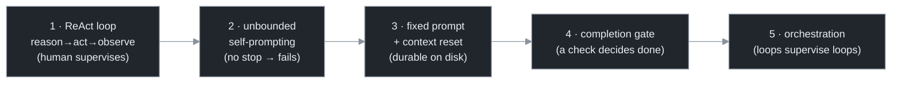

# Chapter 2 — The Lineage: Five Loop Designs

[← Previous](./01-what-is-a-loop.md) · [Index](./README.md) · [Next: The inner loop, formally →](./03-the-inner-loop-formally.md)

> *The loop has five distinct designs, each fixing a specific failure of the last. Knowing which design you're running tells you which failures you've already solved and which you haven't.*

## Concept

"Loop" names at least five different things. They form an engineering progression — each design adds one capability to fix one failure mode of the previous. Place your own system on this ladder and you immediately know what's missing.



## How it works

**Design 1 — the ReAct loop (formalized 2022).** A model produces a reasoning trace, takes an action (a tool call), reads the observation (the result), and repeats until done.[<sup>1</sup>](#sources) Interleaving reasoning with action beats reasoning-only and acting-only, because the reasoning lets the model revise its plan and the actions pull in real facts. This is the *inner* loop inside one agent turn — the heartbeat every later design wraps. (Chapter 3 builds it in code.) Its limit: one agent, a human supervising each task.

**Design 2 — unbounded self-prompting (2023).** Give the model a goal and let it prompt *itself*. Famous for one failure: it doesn't terminate.[<sup>2</sup>](#sources) With a vague goal, no clarifying questions, and recursive self-verification, it loops forever and burns budget. Its lasting contribution is the failure taxonomy that every guardrail in Part V answers: no stopping condition, no external verification, no cost ceiling. The technique was sound; the *harness* was missing.

**Design 3 — fixed prompt + context reset (2025, the "ralph" technique).** Pipe the *same* fixed prompt into a fresh agent every tick; keep durable state in files and git, never in the conversation.[<sup>3</sup>](#sources) This fixes the context-degradation half of design 2 (Chapter 5) and is the workhorse worker loop at the bottom of every larger system. Its limit: no durability beyond an open terminal, and no completion gate.

**Design 4 — productized completion gates (early 2026).** Wrap the fixed-prompt loop with a check that decides *done*: a completion condition that a separate validator confirms, rather than the agent declaring victory.[<sup>4</sup>](#sources) This is what `/goal` and `/loop` ship (Chapter 6). It fixes design 2's "never stops" by making termination external and checkable.

**Design 5 — orchestration (now).** A supervisor loop dispatches work to many worker loops, monitors them on a schedule, and stores state in git so work survives a crash.[<sup>5</sup>](#sources) This is the genuinely new layer (Part IV): the loop, not the task, becomes the unit of work; loops supervise loops; scheduling replaces the human kickoff; durability is explicit.

The takeaway from the ladder: "single-agent loops are old hat" and "orchestration loops are the frontier" are both true — about different designs. Name the design before you argue about it.

**A second axis — topology.** The five designs are a *historical* progression of guardrails. Orthogonal to it is **topology**: how the candidates inside a loop relate to one another — one artifact refined in place (designs 3–4), N independent attempts run in parallel (Chapter 12's fan-out), or N candidates that compete and cross-pollinate across generations (evolutionary search, Chapter 12). Designs tell you which failures you've already solved; topology tells you the shape of the search. Most systems pick a design without noticing they also picked a topology.

## Implement it

The most instructive code in this chapter is the design-2 failure, because the rest of the manual exists to fix it. This is the loop you must *never* ship:

```python
# THE ANTI-PATTERN — unbounded self-prompting. Every line that's missing is a later chapter.
while True:                          # no iteration cap        → Chapter 13
    out = agent(goal + history)      # context grows unbounded  → Chapter 5
    history += out                   # rot compounds each tick  → Chapter 5
    # no verification of `out`        → Chapter 7
    # no budget ceiling               → Chapter 14
    # no check for "stuck"            → Chapter 13
    # no durable state / resume       → Chapter 15
```

Run that against a real task and it will, given enough iterations, spend an unbounded amount producing confident garbage. Annotate each missing line with the chapter that supplies it and you have the table of contents for Part II onward. The fix is not a better model — it's the harness.

## Builds on

Chapter 1 gave the three-line skeleton (`decide` / `apply` / `goal_met`). This chapter shows the naive expansion of it (design 2) and tags each of its missing guardrails with the chapter that adds it. The evolving `loop.py` starts in earnest in Chapter 3 with design 1 done correctly.

## Pitfalls

1. **Arguing about "loops" without naming the design.** Most disagreements are two people meaning design 3 and design 5. State the design first.
2. **Reading design 2's failure as proof loops don't work.** It proved that *unbounded, unverified* loops don't work — which is why Parts III and V exist. The loop was sound; the harness was absent.
3. **Skipping straight to orchestration (design 5).** A fleet of unverified worker loops multiplies design 2's failure. Get one bounded, verified loop working first (Chapter 18's maturity ladder).

## Takeaway

Five loop designs, each fixing one failure of the last: the ReAct loop (reason→act→observe), unbounded self-prompting (fails — no stop), fixed-prompt + context reset (durable state on disk), the completion gate (a check decides done), and orchestration (loops supervising loops). The design-2 anti-pattern is the manual's spine: every missing guardrail in it is a chapter ahead.

## Sources

| # | Source | Supports | Link |
|---|--------|----------|------|
| 1 | Yao et al., *ReAct: Synergizing Reasoning and Acting in LMs* (arXiv 2022 / ICLR 2023) | the reason→act→observe loop beats reason-only and act-only | [arxiv.org/abs/2210.03629](https://arxiv.org/abs/2210.03629) |
| 2 | AutoGPT (2023), and post-mortems of its failure modes | unbounded self-prompting fails by not terminating; the failure taxonomy | [en.wikipedia.org/wiki/AutoGPT](https://en.wikipedia.org/wiki/AutoGPT) |
| 3 | "ralph" technique (Jul 2025) | fixed prompt + fresh context + state on disk | [ghuntley.com/ralph](https://ghuntley.com/ralph/) |
| 4 | Claude Code CHANGELOG — `/goal`, `/loop` (v2.1.154, spring 2026) | productized completion gates and scheduling | [github.com/anthropics/claude-code](https://raw.githubusercontent.com/anthropics/claude-code/refs/heads/main/CHANGELOG.md) |
| 5 | Open-source orchestration system "Gas Town" (Jan 2026) | loops supervising loops with git-durable state | [github.com/gastownhall/gastown](https://github.com/gastownhall/gastown) |
