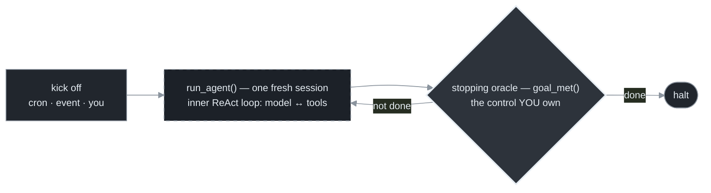
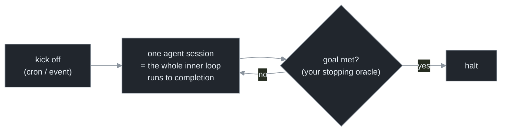
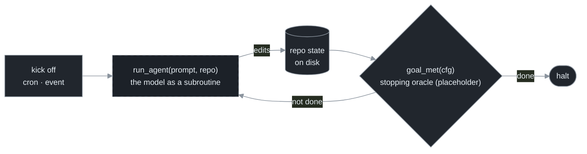

# Chapter 3 — Inner Loop vs Outer Loop

[← Previous](./02-the-lineage.md) · [Index](./README.md) · [Next: The ralph technique →](./04-the-ralph-technique.md)

> *Two loops, two stop conditions. The inner loop runs inside one agent turn and the harness drives it. The outer loop wraps the whole agent and you drive it. This manual is about the outer loop.*

<!-- milestone-delta -->
> **Part I (Foundations) at a glance — what this chapter adds.** The agent's *inner* ReAct loop is run for you; the **outer** loop and its **stopping oracle** are the program you write — and the whole agent is just a subroutine inside it.


*Highlighted = what this milestone adds · dashed border = an external dependency (the model, the gate, git/forge); solid = the loop's own code + files.*

## Concept

There are two loops, and conflating them is the most common confusion in the topic.

- **Inner loop** — the ReAct cycle inside a single agent turn: invoke the model → execute the tool calls it requests → append the results → invoke again → stop when the model stops asking for tools. The agent runtime (Claude Code, Codex) runs this for you. The model decides when *this turn* ends.
- **Outer loop** — a program *you* write that wraps the whole agent, re-invoking it across many turns, usually as many *fresh* sessions, with durable state and a stopping condition *you* control.



From the outer loop's point of view, the entire agent — inner loop, tools, reasoning — is a single function call: hand it a prompt and the current repo state, it returns a new repo state. **The model is a subroutine.**[<sup>1</sup>](#sources) Your job is the control flow around that call: what prompt to feed next, and when to stop.

## How it works

The inner loop, in pseudocode, is what the runtime executes for you:

```python
def agent_turn(prompt, tools, max_steps=10):
    messages = [system, prompt]
    for _ in range(max_steps):              # the recursion limit — always set it
        reply = model(messages, tools)
        messages.append(reply)
        if not reply.tool_calls:
            return reply.content            # TERMINATION: model stops asking for tools
        for call in reply.tool_calls:
            try:    result = run_tool(call)
            except Exception as e: result = f"ERROR: {e}"   # errors round-trip as observations
            messages.append(result)
    raise RuntimeError("inner loop exceeded max_steps")
```

Two facts recur at the outer scale: termination is the model's decision (it stops emitting tool calls), and a tool error becomes an *observation* the model can react to, not a crash.[<sup>1</sup>](#sources)

The critical design point is that **the inner loop's termination is the wrong signal for the outer loop.** "The model stopped asking for tools" means *the model thinks this turn is done* — not that the *task* is complete. A model judging its own work as complete, with no external check, is unreliable (Chapter 7). And real tasks span many turns. So the outer loop needs its own **stopping oracle**: an external check (a passing test, a satisfied completion condition) that decides whether the *goal* is met. Choosing that oracle well is most of the craft.

## Implement it

Here the evolving artifact begins for real. Treat the agent as a subprocess (fresh context every call — Chapter 5 explains why), and wrap it in an outer loop with an explicit, replaceable stopping oracle. Everything in later chapters slots into this file.

```python
# loop.py — v0.2. The outer-loop skeleton. The whole capstone grows from this.
import subprocess

def run_agent(prompt: str, repo: str) -> None:
    """One outer-loop tick = one fresh agent session. The model is a subroutine."""
    subprocess.run(["claude", "-p", "--permission-mode", "acceptEdits"],
                   cwd=repo, input=prompt, text=True)

def goal_met(cfg) -> bool:
    """The STOPPING ORACLE — external, not the agent's opinion. Made real in Ch 6–7."""
    return False  # placeholder

def run_loop(cfg) -> str:
    for i in range(cfg.max_iter):           # placeholder cap — hardened into 3 stops in Ch 13
        run_agent(cfg.prompt, cfg.repo)
        if goal_met(cfg):
            return "done"
    return "iteration_cap"
```

Note what is *not* here yet and which chapter adds it: a real prompt and anchor files (Ch 4–5), a real `goal_met` (Ch 6–7), the budget and no-progress stops (Ch 13), durable commits (Ch 15). The skeleton is deliberately thin so each concern arrives in isolation.

## Builds on

Chapter 1's three-line skeleton, now in real Python: `run_agent` is `apply`, `goal_met` is the `done` check, and the `for` bound is a placeholder for the stopping logic. Chapter 2's design-1 (the ReAct inner loop) is the thing `run_agent` invokes; this chapter wraps it in the outer loop the rest of the manual hardens.

## Pitfalls

1. **Using inner-loop termination as the outer-loop stop.** "The agent finished its turn" ≠ "the task is done." Wire a real stopping oracle (Chapter 6–7).
2. **Letting tool errors crash the loop.** At both scales, an error the model can *see* is one it can fix; an error that kills the process is one it can't. Catch and return errors as observations.
3. **Carrying conversation across ticks by default.** It's the easy path and it degrades (Chapter 5). Default to a fresh session each tick; keep state on disk.

## Takeaway

The inner loop is ReAct inside one turn; the runtime drives it and the model decides when the turn ends. The outer loop wraps the whole agent as a subroutine and *you* drive it, supplying an external stopping oracle because the model's "I'm done" is not a trustworthy stop. The `loop.py` skeleton here is the seed of the capstone; every later chapter slots one concern into it.

<!-- milestone-cumulative -->
## The loop so far — Part I: the outer-loop skeleton

Kick off a fresh session, let the model edit the repo, ask the stopping oracle whether to go again. Everything in later parts slots into this shape (`loop.py` v0.2).


*Dashed = external dependency (the model, the gate, git/forge); solid = the loop's own code + files.*

## Sources

| # | Source | Supports | Link |
|---|--------|----------|------|
| 1 | Yao et al., *ReAct* (2022 / ICLR 2023) | the inner loop: reason→act→observe, model-decided termination, errors as observations | [arxiv.org/abs/2210.03629](https://arxiv.org/abs/2210.03629) |
| 2 | Companion curriculum, `agents/05-execution-loop.md` | inner-loop mechanics, parallel tool calls, recursion limits in depth | [local](../agents/05-execution-loop.md) |
| 3 | "Large Language Models Cannot Self-Correct Reasoning Yet" (ICLR 2024) | why the outer-loop stop must be external, not the model's self-assessment | [arxiv.org/abs/2310.01798](https://arxiv.org/abs/2310.01798) |
