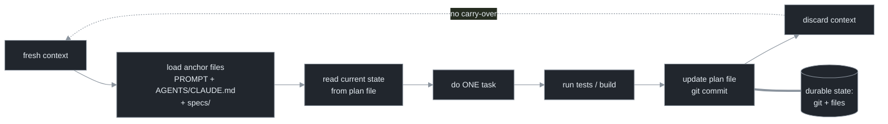

# Chapter 4 — The ralph Technique

[← Previous](./03-the-inner-loop-formally.md) · [Index](./README.md) · [Next: Context-reset discipline →](./05-context-reset-discipline.md)

> *The minimal working outer loop: a fixed prompt piped into a fresh agent, forever, with all durable state on disk. It is the worker loop at the bottom of every larger system — learn it cold.*

## Concept

The **ralph technique** is the simplest outer loop that works: pipe the *same fixed prompt* into a coding agent every tick, give the agent a fresh context each time, and keep all durable progress in files and git — never in the conversation.[<sup>1</sup>](#sources) Its power is not the code (which is trivial); it is the **discipline** the code enforces: by discarding the conversation every tick, it sidesteps context degradation (Chapter 5) without any machinery.

Two rules define it:

1. **The prompt is fixed.** You do not hand-edit it each tick. If you find yourself editing it every iteration, you've become the entity in the loop again (Chapter 1).
2. **State lives on disk.** A spec describes *what* to build; a plan file tracks *what's done*; git holds the history. The model's context is disposable scratch space, rebuilt from these each tick.

## How it works

One iteration reads durable state from disk, does exactly one unit of work, verifies it, writes the result back to disk, and discards its context:



The diagram's two ideas: **ephemeral context inside one tick** versus **durable filesystem across ticks** (the loop-back edge carries nothing), and **one task per tick** (trying to do everything in one tick reintroduces the long-context problem ralph exists to avoid).

A production refinement: split the fixed prompt into a **plan** mode and a **build** mode, and prefer *re-running the loop on fresh code with the same prompt* over having the agent merge its own branches — let the spec, not the diff, be the source of truth.[<sup>2</sup>](#sources)

The one thing ralph lacks is **durability beyond an open terminal**: there is no checkpoint or resume, so if the process dies the loop dies (the *work* survives in git; the *loop* doesn't restart itself). That gap is the seam where orchestration and durability begin (Chapters 11, 15).

## Implement it

The ralph form of the artifact is `loop.sh` — the bash version of `loop.py`, kept in the manual because reading the two side by side shows that the Python harness is just this with guardrails made explicit:

```bash
# loop.sh — the ralph form. Fixed prompt, fresh context, state on disk.
MODEL="${MODEL:-claude-fable-5}"
while :; do
  cat PROMPT.md | claude -p --permission-mode acceptEdits --model "$MODEL"   # fresh context each tick
  git add -A && git commit -m "loop tick" --quiet 2>/dev/null || true        # durable checkpoint
  ./verify.sh && break                                                       # stopping oracle (Ch 6–7)
done
```

with the anchor files beside it — the loop's real memory:

```
ralph-project/
├── PROMPT.md               # the FIXED instruction (identical every tick)
├── AGENTS.md / CLAUDE.md   # conventions, build/test commands, hard constraints
├── specs/                  # source of truth: WHAT to build, what "done" looks like
└── IMPLEMENTATION_PLAN.md  # mutable on-disk state: done / next / known issues
```

The naked `while :; do cat PROMPT.md | claude -p ; done` is the teaching version — and exactly the design-2 anti-pattern from Chapter 2 until you add the `break` on a verification gate. The two additions above (`commit` for durability, `./verify.sh && break` for a stopping oracle) are the first two guardrails from the anti-pattern's annotation list.

## Builds on

Chapter 3's `run_agent` becomes concrete: `cat PROMPT.md | claude -p` is a fresh-context agent call with a real fixed prompt. The placeholder `goal_met` becomes `./verify.sh` (made rigorous in Chapter 7). The anchor-file layout is the durable state the outer loop reads each tick.

## Pitfalls

1. **Letting the prompt drift.** The whole bet is the *fixed* prompt. Hand-editing it each tick puts you back in the loop. Tune it deliberately and rarely.
2. **Doing more than one task per tick.** Reintroduces long context and its degradation. One task, update the plan, stop.
3. **Trusting it to survive a crash.** It won't restart itself. For anything you can't babysit, add the durability layer (Chapter 15) before relying on it.

## Takeaway

ralph is the minimal outer loop: a fixed prompt into a fresh-context agent, one task per tick, all durable state in files and git. It is the worker loop inside every larger system. Its missing piece — durability beyond an open terminal — is the seam where the rest of the manual takes over.

## Sources

| # | Source | Supports | Link |
|---|--------|----------|------|
| 1 | "ralph" technique writeup (Jul 2025) | the one-liner, anchor files, one-task-per-tick, fresh context | [ghuntley.com/ralph](https://ghuntley.com/ralph/) |
| 2 | Reference implementation + production accounts (2025–26) | plan/build prompt split, re-run-on-fresh-code, overnight batching. *(Note: the widely-repeated "built a language for $297" welds two separate facts — a $297 contract-MVP anecdote and a separate ~3-month, unpriced language build. Cite them separately.)* | [github.com/ghuntley/how-to-ralph-wiggum](https://github.com/ghuntley/how-to-ralph-wiggum) · [humanlayer.dev](https://www.humanlayer.dev/blog/brief-history-of-ralph) |
