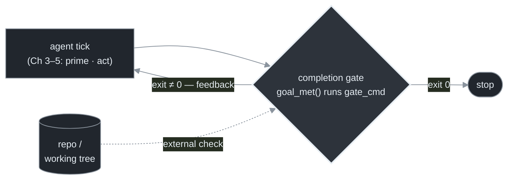
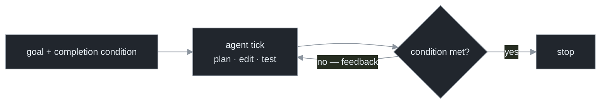
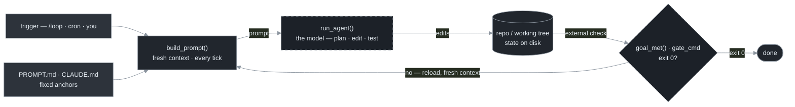

# Chapter 6 — The Completion Gate (`/goal` and `/loop`)

[← Previous](./05-context-reset-discipline.md) · [Index](./README.md) · [Next: The feedback imperative →](./07-the-feedback-imperative.md)

> *The two halves of the outer loop, productized: a completion gate that decides when to stop, and a scheduler that decides when to start. This chapter makes the stopping oracle real.*

<!-- milestone-delta -->
> **Part II (The Single-Agent Loop) at a glance — what this chapter adds.** The stopping oracle becomes *real*: Chapter 3's placeholder turns into an **external completion gate** (`gate_cmd`, exit 0 = done) — a checkable condition, not the model's own opinion.


*Highlighted = what this milestone adds · dashed border = an external dependency (the model, the gate, git/forge); solid = the loop's own code + files.*

## Concept

The outer loop has two control questions, and two slash commands answer them:[<sup>1</sup>](#sources)

- **`/goal` — when does it stop?** You set a completion condition and the agent keeps working across turns until it's met. This is a **completion gate**: termination is decided by an external check, not by the agent declaring victory.
- **`/loop` — when does it start?** You schedule a prompt or slash-command to run unattended, on an interval (cron under the hood) or self-paced.

Used together: a `/loop` that fires hourly and runs a `/goal` until the goal is met, then sleeps. The key word is *condition* — the completion gate replaces "the agent thinks it's done" with "a check says it's done."

## How it works

`/goal` runs the agent repeatedly and routes each result through a completion check; the loop exits only when the check passes:



The strongest completion conditions are **deterministic and external**: a command that exits 0, a test suite that passes, a file that exists. "Until the feature is good" hands the stop to a fallible judge; "until `npm test` exits 0" does not. (The behavior — loop until a condition holds — is documented; the internal mechanism, often described as a separate lightweight validator model, is reported but not spec-confirmed. Build on the behavior.)[<sup>1</sup>](#sources)

For unattended runs there is a standard five-part configuration:[<sup>2</sup>](#sources)

| Layer | What it does | Chapter |
|---|---|---|
| Auto-approve permissions | the agent doesn't stop to ask | 16 |
| Orchestrate many agents | fan out the work | 12 |
| `/goal` or `/loop` | drive it until done / on a schedule | 6 |
| Run in the cloud | survive a closed laptop | 15 |
| Self-verify end to end | the agent checks its own work | 7 |

The last is the one practitioners stress and hype skips: a loop is only as trustworthy as its ability to check itself (Chapter 7).

## Implement it

`/goal` is the productized form of the `goal_met` placeholder from Chapter 3. Implement the same thing yourself by running an external gate command and looping on its exit code — this is exactly what makes the bash ralph loop safe:

```python
# loop.py delta — the completion gate. goal_met() becomes a real external check.
def goal_met(cfg) -> bool:
    """Run the external gate. Exit 0 == done. This is the stopping oracle."""
    rc = subprocess.run(cfg.gate_cmd, cwd=cfg.repo, shell=True).returncode
    return rc == 0
```

In Claude Code the same loop is one command — note the completion condition is a *checkable* statement, not a vibe:

```
/goal Make CI green. Keep fixing failures until `npm test` and `npm run typecheck`
      both pass with zero errors.

/loop Babysit all my PRs. Auto-fix build issues; when comments come in, use a
      worktree agent to fix them.
```

`/loop`'s clause "use a worktree agent" isolates each fix in its own git worktree so parallel fixes can't collide (Chapter 10).

**Codex parity** (for teams running both): the scheduling and orchestration analogues exist, but the enforced completion gate does not — port it by hand.

| You want | Claude Code | OpenAI Codex |
|---|---|---|
| Loop until done, **enforced gate** | `/goal` | *no equivalent* — `AGENTS.md` "Done when" is advisory + `/review` |
| Recurring runs (cron) | `/loop` | Automations |
| Many agents | dynamic workflows | subagents / parallel tasks |
| Permissionless autonomy | auto mode | sandbox-first execution |
| Cloud / close laptop | Routines / web | Codex cloud tasks |
| Conventions file | `CLAUDE.md` | `AGENTS.md` |

Moving a `/goal` loop to Codex means wrapping the run in your own `while` that checks the gate and re-invokes — back to `loop.sh`.[<sup>3</sup>](#sources)

## Builds on

Chapter 3's placeholder `goal_met` becomes a real external gate (`cfg.gate_cmd`), and Chapter 4's `./verify.sh && break` is the bash form of the same thing. The completion condition is the outer-loop stopping oracle Chapter 3 said you'd need; Chapter 7 makes the gate itself rigorous.

## Pitfalls

1. **A vague `/goal` condition.** "Until it's good" delegates the stop to a fallible judge and invites both early-stop and never-stop. Use a command that exits 0.
2. **A `/loop` with no budget or iteration cap.** Scheduling plus no stopping conditions is the runaway failure at cron cadence. `/goal`'s gate handles *task* completion, not *runaway* protection — you still need the three hard stops (Chapter 13).
3. **Assuming Codex parity.** Porting a `/goal` loop without re-adding the gate yields an unbounded loop. Re-implement the oracle.
4. **Trusting slash-command syntax from any doc (including this one).** These change fast; `/help` in a live session is the authority for current syntax.

## Takeaway

`/goal` productizes the stopping oracle — loop until an external completion condition holds, ideally a command that exits 0 — and `/loop` productizes scheduling. Implement the same thing yourself by looping on a gate command's exit code. Codex offers scheduling and orchestration parity but no enforced gate; port it by hand.

<!-- milestone-cumulative -->
## The loop so far — Part II: the complete single-agent loop

A trigger starts it, `build_prompt()` reloads a *fresh* context from the anchor files every tick, the model edits the repo, and the completion gate decides done-or-loop. State lives on disk; context never accumulates.


*Dashed = external (the model, the gate); solid (highlighted) = your anchor files + trigger; solid = the loop's own code.*

## Sources

| # | Source | Supports | Link |
|---|--------|----------|------|
| 1 | Claude Code CHANGELOG (v2.1.154) | `/goal` completion-condition behavior; `/loop` scheduling, cron under the hood | [github.com/anthropics/claude-code](https://raw.githubusercontent.com/anthropics/claude-code/refs/heads/main/CHANGELOG.md) |
| 2 | Autonomous-run recipe (2026) | the five-layer configuration for hours/days-long runs | [threads.com](https://www.threads.com/@boris_cherny/post/DZTmR4omqZ3/) |
| 3 | OpenAI Codex best practices | Codex analogues: Automations, "Done when" criteria (advisory), `/review`, AGENTS.md | [developers.openai.com/codex](https://developers.openai.com/codex/learn/best-practices) |
