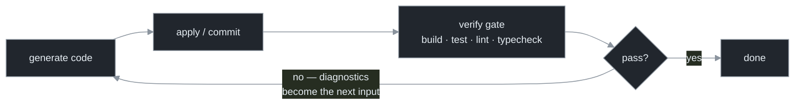

# Chapter 7 — The Feedback Imperative

[← Previous](./06-goal-and-loop-productized.md) · [Index](./README.md) · [Next: Continuous review →](./08-continuous-review.md)

> *A loop is only as good as its ability to check its own work — and the check must be external, because a model cannot reliably grade its own homework. This is the most important chapter in the manual.*

## Concept

State it plainly:

> **An open loop that writes code with no feedback is a machine for generating confident mistakes. A loop that writes, runs, reads the result, and corrects is the thing that works. The loop is not the magic — the feedback is.**

Every other production concern (halting, durability, orchestration) assumes this one is solved. If the loop can't tell good output from bad, making it faster, cheaper, and more parallel just reaches ruin sooner. The result is not theoretical: a published study shows that **intrinsic self-correction** — a model re-reading its own reasoning with no external signal — does *not* reliably improve correctness and can degrade it, while **feedback-driven correction** against an external signal works.[<sup>1</sup>](#sources) So the "check" in "a loop that checks itself" must be grounded outside the model's own confidence: a failing test, a compiler error, a different model's verdict.

## How it works

The terms are borrowed from control theory, exactly. An **open-loop** controller issues commands without measuring the result — fine only if its model of the world is perfect. A **closed-loop** controller measures the output, computes the error against the target, and feeds that error back to drive the system toward the target. An LLM writing code is a *deeply* imperfect model of "what this codebase needs"; the test output is the error signal that tells the loop how far from done it is.

| | Open loop (no feedback) | Closed loop (feedback stabilizes) |
|---|---|---|
| The cycle | generate → apply → *hope* | generate → apply → **run the gate** |
| On failure | never finds out | the error feeds back as the next input |
| Behavior | drifts; confident mistakes | drives toward the target until the gate passes |



**Verify end to end** — the check must reach the *actual goal*, not a proxy. The gap between proxy and goal is exactly where confident mistakes hide:

| Goal | Weak proxy check | End-to-end check |
|---|---|---|
| Fix the bug | code compiles | the test that reproduced the bug now passes |
| Build the feature | unit tests pass | the feature works in a real run |
| Migrate the service | files converted | the migrated service boots and serves traffic |
| Make CI green | local lint passes | the actual CI pipeline goes green on the pushed branch |

Stack gates **cheap-to-expensive** and run the cheap ones more often: static/typecheck (ms) → unit (s) → integration/e2e (min) → semantic judgment (a model or human, treated with suspicion — Chapter 9). Each rung filters cheap failures before you spend on the expensive ones.

A speed corollary: **bad commits compound.** A loop committing every ninety seconds, open-loop, produces bad commits at machine speed, and each becomes the foundation the next tick builds on. The faster the loop, the more essential the feedback closes *before* the next commit lands (Chapter 8).

## Implement it

The gate runs the build/test commands and returns both a pass/fail and, on failure, the diagnostics to feed back. The `loop.py` delta turns the open loop into a closed one:

```python
# loop.py delta — the verification gate closes the loop. Failure becomes the next tick's input.
from dataclasses import dataclass

@dataclass
class GateResult:
    passed: bool
    feedback: str | None

def verification_gate(cfg) -> GateResult:
    proc = subprocess.run(cfg.gate_cmd, cwd=cfg.repo, shell=True,
                          capture_output=True, text=True)
    if proc.returncode == 0:
        return GateResult(True, None)
    return GateResult(False, (proc.stdout + proc.stderr)[-2000:])   # diagnostics → feedback

def run_loop(cfg) -> str:
    feedback = None
    for i in range(cfg.max_iter):
        run_agent(build_prompt(cfg.repo, feedback), cfg.repo)   # feedback from Ch 5's build_prompt
        gate = verification_gate(cfg)
        if gate.passed:
            return "done"
        feedback = gate.feedback                                # CLOSED LOOP: error → next input
    return "iteration_cap"
```

The single load-bearing line is `feedback = gate.feedback`: without it, running the tests is just expensive logging. The error must become the next tick's input for the loop to be closed.

## Builds on

Chapter 6's `goal_met` (a bare exit-code check) becomes `verification_gate` returning *both* a verdict and the diagnostics, and Chapter 5's `build_prompt(repo, feedback)` parameter is finally filled. The placeholder `for i in range(cfg.max_iter)` is still a placeholder — Chapter 13 replaces it with the three hard stops.

## Pitfalls

1. **Self-assessment as the gate.** "The agent reviewed its own work and it's good" is intrinsic self-correction — the thing shown not to work. The gate must be external.
2. **Proxy mistaken for end-to-end.** "It compiles" is not "it works." The confident-mistake class lives in that gap; close it with a check that reaches the real goal.
3. **A gate too slow to run each tick.** If the only real check takes 20 minutes, the loop either skips it (open again) or crawls. Build a fast inner gate and a slower outer gate on a cadence.
4. **No feedback path.** Running tests and not feeding failures back is logging, not a loop. The error must become the next input.

## Takeaway

A loop is only as good as its feedback. Open-loop generation produces confident mistakes; closed-loop generation drives toward the target using an external error signal. The model cannot reliably grade its own homework, so the gate must be external (tests, compiler, a different model), end-to-end (reach the real goal, not a proxy), and wired so the failure becomes the next tick's input — and *stable*: a gate that flips verdict on unchanged code corrupts every stop decision, so prove it's deterministic before you trust it as the loop's oracle (Chapter 9).

## Sources

| # | Source | Supports | Link |
|---|--------|----------|------|
| 1 | "Large Language Models Cannot Self-Correct Reasoning Yet" (ICLR 2024) | intrinsic self-correction fails; external feedback is what works | [arxiv.org/abs/2310.01798](https://arxiv.org/abs/2310.01798) |
| 2 | *A Survey on Code Generation with LLM-based Agents* (2025) | the generate→execute→verify→repair closed loop in code | [arxiv.org/abs/2508.00083](https://arxiv.org/abs/2508.00083) |
| 3 | Practitioner account, creator of Claude Code (2026) | self-verification as "the most important thing"; ~2–3× quality (a practitioner estimate, not a benchmark) | [getpushtoprod.substack.com](https://getpushtoprod.substack.com/p/how-the-creator-of-claude-code-actually) |
