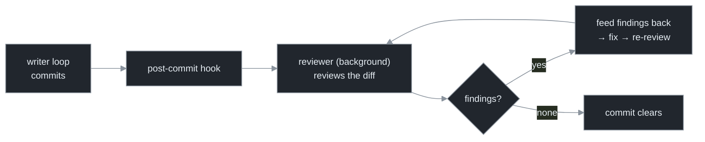

# Chapter 8 — Continuous Review

[← Previous](./07-the-feedback-imperative.md) · [Index](./README.md) · [Next: Evals & regression for loops →](./09-evals-and-regression-for-loops.md)

> *The synchronous gate catches what's mechanically checkable. A second, asynchronous channel — a reviewer watching every commit — catches what passes the tests and is still wrong, and feeds it back before it compounds.*

## Concept

The gate from Chapter 7 catches everything mechanically checkable: compiles, tests pass, types check. It does *not* catch the large class of problems that pass every test and are still wrong — a logic bug the tests don't cover, a security hole, a performance regression, code that works but no reviewer would accept. **Continuous review** is the second feedback channel for that class:

> **Review every commit the loop produces, in the background, and feed the findings back while the context that produced them is still fresh.**

It is a second loop running *alongside* the worker loop — a reviewer watching the writer's output stream and injecting corrections. The two channels are complementary, and a serious loop runs both.

## How it works

The timing is the whole point. A bug found a week later lands on a developer who has context-switched away; reconstructing intent is expensive. A bug found seconds after the commit, fed back into the loop that just wrote it, lands while the intent is still on disk and the diff is still the most recent thing — the fix is cheap, local, and correct.

For a machine-speed loop the stakes are higher because of compounding (Chapter 7): if review waits, the loop has already built three more commits on top of the bad one, turning an amend into a four-commit rebase. So review closes the loop at **commit granularity**.



The reference design is a tool that hooks post-commit, reviews each diff in a background worker pool, persists findings, and loops fix → re-review until clean — itself a small completion-gated loop with the *review verdict* as the gate.[<sup>1</sup>](#sources)

Two design rules carry over from Chapter 7 and forward into Part IV:

- **Use a different model (or at least a different context) for review than for writing.** A model reviewing its own fresh output, in the same context, is intrinsic self-correction again. The reviewer should come at the diff cold.
- **The reviewer is itself a worker loop.** A writer loop plus a reviewer loop feeding each other *is* a small multi-loop system — the doorway to orchestration (Part IV). Supervisory "patrol" loops (Chapter 11) are this idea scaled up.

The two channels divide the work:

| | Synchronous gate (Ch 7) | Continuous review (Ch 8) |
|---|---|---|
| Timing | blocks the tick — must pass to proceed | async — runs after the commit, in parallel |
| Checks | mechanical: compiles, tests, types | semantic: correctness, security, convention |
| Signal | deterministic (exit code) | judgment (a reviewer's findings) |
| Trust | high | lower (the reviewer is fallible — Ch 9) |
| Catches | "it doesn't work" | "it works and is still wrong" |

The gate is your floor; review is your ceiling. Neither replaces the other.

## Implement it

Add a post-commit review step that runs a *different-model* review over the latest diff and turns findings into feedback for the next tick. The `loop.py` delta:

```python
# loop.py delta — continuous review as a second feedback channel.
def review_commit(cfg) -> str | None:
    """Review the latest diff with a DIFFERENT model. Returns findings text, or None if clean."""
    diff = subprocess.run(["git", "diff", "HEAD~1", "HEAD"], cwd=cfg.repo,
                          capture_output=True, text=True).stdout
    if not diff.strip():
        return None
    prompt = f"Review this diff for correctness, security, and convention issues. " \
             f"Report concrete problems only, or 'OK' if none.\n\n{diff}"
    out = subprocess.run(["claude", "-p", "--model", cfg.review_model],   # different model than the writer
                         cwd=cfg.repo, input=prompt, capture_output=True, text=True).stdout
    return None if out.strip() == "OK" else out
```

Wire it after `verification_gate` passes: `findings = review_commit(cfg)`; if findings, set them as the next tick's `feedback` so the writer corrects while context is fresh. In Claude Code you can attach the equivalent as a real git post-commit hook so it fires with no orchestration code at all.

## Builds on

Chapter 7 gave one feedback channel (the synchronous gate); this adds the second (asynchronous review), reusing the same `feedback → next tick` wiring. The "different model for review" rule is the same external-check principle from Chapter 7, applied to the reviewer. The writer+reviewer pair is the first multi-loop system, which Part IV generalizes.

## Pitfalls

1. **Reviewing on a human cadence (PR-time, daily).** Too late for a machine-speed loop — the bad commit has compounded. Review at commit granularity.
2. **The writer reviews itself.** Same model, same context, same blind spots. Use a separate reviewer.
3. **Findings that don't feed back.** A reviewer nothing acts on is an expensive linter you never read. Close the loop: findings → fix → re-review.
4. **Treating the reviewer's verdict as ground truth.** It's a fallible judge (Chapter 9). Use it to surface candidates; never let "the reviewer approved it" override a failing test.

## Takeaway

Continuous review is the second feedback channel: a background reviewer loop checking every commit and feeding findings back before they compound, while the producing context is fresh. It composes with — does not replace — the synchronous gate: the gate is the deterministic floor, review the semantic ceiling. Use a different model for review, and wire findings into the next tick. The writer+reviewer pair is your first step into multi-loop systems.

## Sources

| # | Source | Supports | Link |
|---|--------|----------|------|
| 1 | Continuous-review tool ("roborev", Kenn Software, 2026) | post-commit background review, persisted findings, fix→re-review loop. *(Often attributed to an individual in social posts; primary materials credit the org — treat authorship as unconfirmed.)* | [github.com/kenn-io/roborev](https://github.com/kenn-io/roborev) |
| 2 | "Large Language Models Cannot Self-Correct Reasoning Yet" (ICLR 2024) | why the reviewer must be external to the writer | [arxiv.org/abs/2310.01798](https://arxiv.org/abs/2310.01798) |
| 3 | Companion curriculum, `agents/23-evals-and-regression-testing.md` | LLM-as-judge fallibility (the reviewer's failure modes) | [local](../agents/23-evals-and-regression-testing.md) |
