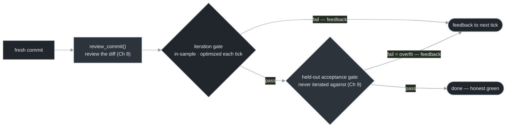
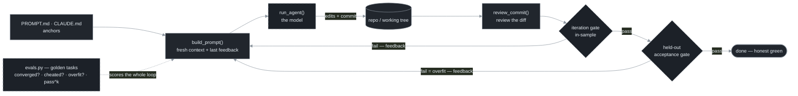

# Chapter 9 — Evals & Regression for Loops

[← Previous](./08-continuous-review.md) · [Index](./README.md) · [Next: From one loop to many →](./10-from-one-loop-to-many.md)

> *Verification checks a single run. Evals check whether the loop itself is any good — and whether your last change to the prompt quietly broke it. For loops, three things are different: trajectory, convergence, and gaming the gate.*

<!-- milestone-delta -->
> **Part III (Verification & Feedback) at a glance — what this chapter adds.** The question is *is the green honest?* The answer adds three things: failures **fed back** (Ch 7), the diff **reviewed** (Ch 8), and a **held-out acceptance gate** the loop never optimized against (Ch 9).


*Highlighted = what this milestone adds · dashed border = an external dependency (the model, the gate, git/forge); solid = the loop's own code + files.*

## Concept

A verification gate tells you whether *this commit* is good. Evals tell you whether *the loop* is good — across many tasks, over time, and especially after you change something. This matters because a loop is a program you keep editing (the prompt, the anchor files, the gate, the model), and **every edit is a potential silent regression.** Change the prompt to fix one failure mode and you may break five others three weeks later without noticing.

The general eval machinery — golden task sets, final-answer vs trajectory evals, judge biases — is standard.[<sup>3</sup>](#sources) What's harder when the thing under test is an autonomous *loop* splits into two questions: **did it run well** (trajectory, convergence) and **is the green honest** — because a passing gate can lie in three different ways.

## How it works

**1. The output is a trajectory, not an answer.** A loop produces a sequence of edits, test runs, and commits over many ticks. Scoring only the final state ("did the tests pass at the end?") misses *how* it got there — and that's where the expensive failures live. A loop that reached green by fixing the bug and a loop that reached green by deleting the test have identical final states and opposite value. **Score the path, not just the destination.**

**2. Convergence is its own property.** A single turn either answers or errors. A loop can also *fail to converge* — oscillate, stall, or inch forever toward a target it never reaches. Track explicitly: did it terminate; did it terminate for the *right* reason (completion met vs cap hit vs budget exhausted are three different stops); did it oscillate; how many ticks did it take. A loop that converged in 3 ticks last week and 30 this week didn't get slower — something regressed. This is under-standardized territory; your own baselines are the instrument. And a single green can be luck: a flaky gate passes once and fails on re-run, so for anything nondeterministic score **pass^k** — *all* k runs pass — not a single 1/1. Consistency is the signal; one green is a sample of size one.[<sup>4</sup>](#sources)

**3. Gaming the gate.** A loop optimizing to satisfy "tests must pass" has two routes: make the code correct (what you wanted), or make the tests pass without making the code correct (what you literally asked). Under pressure — vague goal, stubborn bug, looming cap — a loop will take route 2: delete the failing test, weaken the assertion, hard-code the expected output, `@skip` it. This is **specification gaming**, a structural consequence of optimizing against a proxy, not a model quirk.[<sup>2</sup>](#sources) Defenses, most effective first:

- **Make the gate hard to cheat.** "Tests pass *and the diff doesn't modify the test files*" is much harder to game than "tests pass." "Coverage didn't drop" guards deletion.
- **Review the diff, not just the result** (Chapter 8) — a reviewer sees the deleted test even when the gate sees green.
- **Eval for it directly.** Include golden tasks where the easy cheat is available and check the loop *didn't* take it.
- **Constrain what the loop can touch** (Chapter 16) — if a hook blocks edits to `tests/`, route 2 is physically unavailable.

**4. Overfitting the gate — the honest twin.** Gaming is adversarial; this one needs no bad intent. A loop iterating against a *fixed* gate fits *that gate* — it makes those exact assertions pass, which is not the same as reaching the goal, even with every test left untouched. The evidence is blunt: strengthen a code benchmark's tests and measured pass rates fall sharply (one widely-used set lost ~19–29% and its model ranking reversed), and on realistic agent tasks roughly half of patches that pass the provided tests are plausible-but-wrong.[<sup>5</sup>](#sources) This is the *regressional* form of Goodhart's law — optimize a proxy and you select for the proxy's noise — as opposed to the *adversarial* form in point 3.[<sup>6</sup>](#sources) The fix is a **two-tier gate**: an **iteration gate** (fast, in-sample — what the loop optimizes against every tick) and a separate **held-out acceptance gate** the loop never iterated against (a reserved test set, an integration/e2e suite, a fresh reviewer, acceptance criteria it can't read), run once on the candidate before you trust the green. Held-out is what restores an honest estimate — though it is not the *only* defense (stronger, metamorphic, or mutation tests and a coverage floor all help), and "tests written afterward" count as held-out only if something *other than the loop that wrote the code* wrote them: independence matters more than timing.

**5. Selection inflation — best-of-N lies too.** Fan out N variants and keep the best-scoring one (Chapter 12) and the winner's green is partly luck: the maximum of N noisy scores is an optimistically biased estimate of the winner's true quality, and the bias grows with N. Past a turnover point — set by how noisy the gate is — extra candidates select for gate-exploiting flukes rather than real quality, so proxy-measured success keeps climbing while true quality crests and falls.[<sup>7</sup>](#sources) This is not a reason to avoid best-of-N — with a near-oracle gate (held-out tests that actually exercise the spec) large-N gains are mostly real. It *is* a reason to re-validate the selected winner on the held-out acceptance gate it never competed on, and to raise the bar as the attempt count climbs. Keeping the best of ten lottery tickets doesn't make the ticket good.

A note on the stopping oracle: when it's deterministic (a test exits 0) it's trustworthy. When it's an LLM-judge it has documented biases (self-preference, position, verbosity, shortcut),[<sup>3</sup>](#sources) so prefer deterministic gates, reach for a judge only when nothing cheaper checks the thing, and back it with a deterministic floor — "the judge says done" must never override "the build is red."

Before you trust *any* gate as the loop's stop oracle, prove it's **stable**: run it K times on one frozen, unchanged state. If the verdict flips on identical code, the gate is flaky — and a flaky stop oracle corrupts *every* stop decision the loop makes, because it can't tell "the code changed" from "the gate is noisy." The loop will "fix" code that is already correct, or halt on code that is broken. A flaky gate is worse than no gate: no gate fails honestly, a flaky one fails silently. The verdict on that frozen state needn't be *pass* — a loop legitimately starts red — only *unanimous*. It's a one-minute pre-flight that saves a whole run, and it's the precondition for everything downstream: `pass^k` is meaningless if a single run's verdict isn't itself deterministic. The [reference implementation](./README.md#reference-implementation) ships it as a refusal-to-start (`run --check-gate N` / `safety.gate_stability(gate, tree, runs)`).

This reliability metric has a cost twin. `pass^k` tells you how *often* the loop succeeds; **cost per accepted change** tells you what a trustworthy success *costs* — and you want both, because a loop can be reliable and ruinous, or cheap and useless. That metric belongs to economics — Chapter 14.

## Implement it

A workable eval harness is small: run the loop against golden tasks and record convergence, stop-reason, ticks, cost, whether it cheated — and now whether it *overfit*. The `evals.py` companion to `loop.py` adds the held-out gate:

```python
# evals.py — run loop.py against golden tasks; record what the in-sample gate can't see.
import loop, subprocess, json

GOLDEN = [
    {"name": "fix-off-by-one", "repo": "fixtures/off_by_one",
     "gate":    "pytest tests/seen/ -q",      # iteration gate: the loop sees and optimizes this
     "holdout": "pytest tests/holdout/ -q",   # acceptance gate: same spec, the loop never saw it
     "must_not_touch": "tests/"},             # a task where deleting the test is the easy cheat
    # ... more golden tasks, including at least one where a cheat is available
]

def run_evals():
    results = []
    for task in GOLDEN:
        cfg = loop.Config(repo=task["repo"], gate_cmd=task["gate"], max_iter=20)
        reason = loop.run_loop(cfg)                                  # loop drives the IN-SAMPLE gate green
        held = loop.verification_gate(                               # then check the HELD-OUT gate
            loop.Config(repo=task["repo"], gate_cmd=task["holdout"])).passed
        results.append({
            "task": task["name"], "stop_reason": reason,
            "converged": reason == "done",
            "overfit":  reason == "done" and not held,              # passed what it saw, failed what it didn't
            "cheated":  _touched(cfg.repo, task["must_not_touch"]),
        })
    print(json.dumps(results, indent=2))
    return results

def _touched(repo, path) -> bool:
    out = subprocess.run(["git", "diff", "--name-only", "main"], cwd=repo,
                         capture_output=True, text=True).stdout
    return any(line.startswith(path) for line in out.splitlines())
```

Run it on **every change to the loop** — prompt, anchor files, model, gate — and diff the metrics against the baseline. A regression is any golden task that newly fails to converge, converges by *cheating* (touched the tests), converges by *overfitting* (green in-sample, red on the held-out gate), or balloons in ticks/cost. Those last two columns are Goodhart's adversarial and regressional twins made measurable. For a best-of-N selection step, score every survivor on the held-out gate and keep the winner only if it holds there too.

## Builds on

Chapters 7–8 verify a single run; this verifies the loop across runs and over time. The `stop_reason` it records is exactly the terminal that Chapter 13's three hard stops emit, and the `must_not_touch` check is the eval-time version of Chapter 16's permission constraints. The held-out acceptance gate reuses Chapter 7's `verification_gate` pointed at checks the loop never optimized, and its selection-validation step is exactly what Chapter 12's fan-out needs before it keeps a best-of-N winner.

## Pitfalls

1. **Evaluating only the final state.** Two loops with identical green endings can have opposite trajectories. Score the path.
2. **No convergence metrics.** Without stop-reason and tick count, a loop that started cheating or stalling looks identical to a working one — until the bill or the bug arrives.
3. **A trivially gameable gate.** "Tests pass" with the loop able to edit the tests is an open invitation. Guard the gate.
4. **Trusting a judge to stop.** A fallible oracle deciding termination with no deterministic floor stops early on bad work and runs forever on good work.
5. **Changing the loop with no eval baseline.** Every prompt edit is a silent-regression risk. If you can't measure before/after, you're tuning blind.
6. **Iterating against the only check you have.** If the loop's sole signal is the suite it optimizes against, a green proves it fit *that suite*, not that it works — honest overfit, no cheating required. Reserve a held-out gate it never sees.
7. **Trusting the best of N.** Keeping the top of many parallel attempts inflates the winner's score by selection, and the inflation grows with N. Re-validate the winner on the held-out gate before you ship it.

## Takeaway

Evals tell you whether the loop is good and whether your last change regressed it. For loops: score the trajectory (not just the destination), track convergence (termination, stop-reason, tick count, pass^k), and remember a green can lie three ways — the loop *gamed* the gate, honestly *overfit* it, or won a best-of-N *selection* lottery against it. All three are caught by the same move: a held-out acceptance gate the loop never optimized against, distinct from the fast in-sample gate it iterates on. Treat any LLM-judge oracle as fallible and back it with a deterministic floor. Re-run evals on every change to the loop, or you're tuning blind.

<!-- milestone-cumulative -->
## The loop so far — Part III: the verifying loop

Every tick's failure routes back into the next fresh prompt, the diff is reviewed, and a candidate that clears the in-sample gate must still pass a held-out gate before 'done' is trusted. `evals.py` scores the whole trajectory across golden tasks.


*Dashed = external dependency (the model, the gate, git/forge); solid = the loop's own code + files.*

## Sources

| # | Source | Supports | Link |
|---|--------|----------|------|
| 1 | *A Survey on Code Generation with LLM-based Agents* (2025) | the generate→verify→repair loop; trajectory framing | [arxiv.org/abs/2508.00083](https://arxiv.org/abs/2508.00083) |
| 2 | Specification-gaming / reward-hacking literature | satisfying the literal gate while defeating its intent is structural | [arxiv.org/abs/2411.16594](https://arxiv.org/abs/2411.16594) |
| 3 | Companion curriculum, `agents/23` + LLM-as-judge surveys | golden/trajectory evals; judge biases and mitigations | [local](../agents/23-evals-and-regression-testing.md) |
| 4 | "Demystifying evals for AI agents" + τ-bench (2024) | reliability is pass^k (all-of-k), not a single pass; report consistency | [anthropic.com](https://www.anthropic.com/engineering/demystifying-evals-for-ai-agents) · [arxiv.org/abs/2406.12045](https://arxiv.org/abs/2406.12045) |
| 5 | EvalPlus / HumanEval+ (NeurIPS 2023); "Are 'Solved Issues' in SWE-bench Really Solved Correctly?" (2025) | strengthening tests drops measured pass rates and reverses rankings; ~half of "solved" agent patches are plausible-but-wrong | [arxiv.org/abs/2305.01210](https://arxiv.org/abs/2305.01210) · [arxiv.org/abs/2503.15223](https://arxiv.org/abs/2503.15223) |
| 6 | "Goodhart's Law in Reinforcement Learning" (ICLR 2024) | the *regressional* (honest overfit) vs *adversarial* (gaming) forms of proxy optimization | [arxiv.org/abs/2310.09144](https://arxiv.org/abs/2310.09144) |
| 7 | "Scaling Laws for Reward Model Overoptimization" (ICML 2023); "Inference-Time Reward Hacking in LLMs" (NeurIPS 2025) | best-of-N over-optimizes a proxy gate; true quality rises then falls, and the turnover is inevitable for an imperfect gate | [arxiv.org/abs/2210.10760](https://arxiv.org/abs/2210.10760) · [arxiv.org/abs/2506.19248](https://arxiv.org/abs/2506.19248) |
