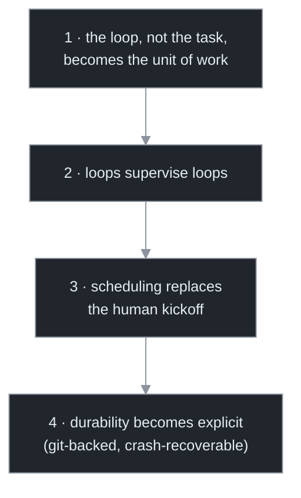
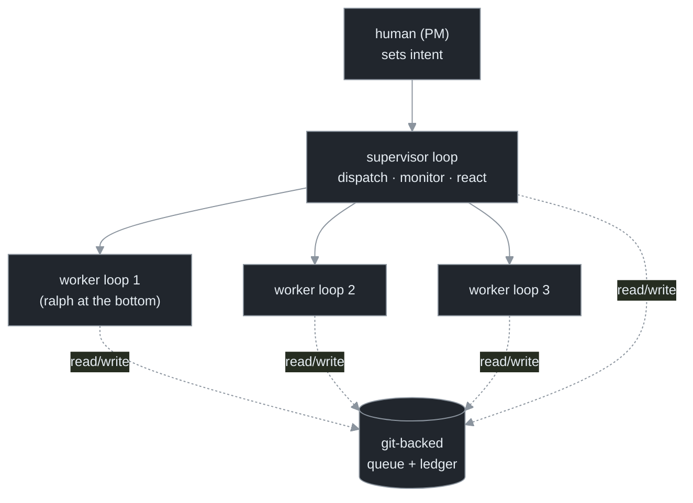

# Chapter 10 — From One Loop to Many

[← Previous](./09-evals-and-regression-for-loops.md) · [Index](./README.md) · [Next: Gas Town & the Mayor pattern →](./11-gastown-and-the-mayor-pattern.md)

> *Orchestration is loops supervising loops: a supervisor loop that dispatches work to worker loops, monitors them, and reacts to the stuck ones. Four shifts make it new, and one constraint — isolation — makes it safe.*

## Concept

Up to now the loop has been singular. **Orchestration** is when the unit becomes plural and a loop's *job* becomes *running other loops*. The new architectural element is a **supervisor loop**: it dispatches work to worker loops, watches their progress, and reacts to the ones that get stuck. The supervisor has a model in its body (it *decides* what to dispatch and how to react), which is what separates it from a job scheduler that just launches N processes.

Four shifts turn parallel agents into a self-governing system. Take all four away and you have "several agents I prompt in parallel"; add them and you have a system that runs your backlog overnight and is still running correctly when you wake:[<sup>1</sup>](#sources)



## How it works

The canonical topology is one supervisor over a pool of workers, with a shared durable store all of them read and write:



Three design facts: the **workers are ralph loops** (Chapter 4 — orchestration supervises a fleet of them, it doesn't replace them); **state lives in the shared store, not any agent's context** (the fresh-context invariant raised to the fleet — any agent can die and another resumes from the store); and the **supervisor's per-tick decisions are the hard part** — what to dispatch, which workers are healthy, how to react to a stuck one, how to integrate finished work. Each is a model decision, which makes orchestration powerful and dangerous in equal measure.

**Isolation is the precondition.** Two agents editing the same working tree corrupt each other instantly. Each worker gets its own **git worktree** on its own branch; the supervisor integrates the branches.[<sup>2</sup>](#sources) Stronger isolation (a container per worker) also bounds each worker's blast radius (Chapter 16).

## Implement it

The orchestration artifact, `orchestrate.py`, reuses `loop.run_loop` as the worker and adds dispatch + isolation. This is the skeleton the next two chapters harden:

```python
# orchestrate.py — supervisor over a bounded pool of isolated worker loops.
import concurrent.futures, subprocess, loop

def make_worktree(repo: str, task_id: int) -> str:
    """ISOLATION: each worker gets its own checkout on its own branch (Ch 16 bounds blast radius)."""
    path, branch = f"{repo}/.worktrees/w{task_id}", f"loop/worker-{task_id}"
    subprocess.run(["git", "worktree", "add", "-b", branch, path, "HEAD"], cwd=repo)
    return path

def run_worker(task_id: int, task: str, gate: str, repo: str) -> str:
    wt = make_worktree(repo, task_id)
    cfg = loop.Config(repo=wt, gate_cmd=gate, max_iter=20)   # a full self-governed loop per worker
    try:
        return loop.run_loop(cfg)                            # returns the stop-reason terminal
    finally:
        subprocess.run(["git", "worktree", "remove", "--force", wt], cwd=repo)

def run_fleet(tasks, gate, repo, max_workers=3):
    """The SUPERVISOR loop: dispatch tasks to a bounded worker pool, collect stop-reasons."""
    with concurrent.futures.ThreadPoolExecutor(max_workers=max_workers) as pool:
        futures = [pool.submit(run_worker, i, t, gate, repo) for i, t in enumerate(tasks, 1)]
        reasons = [f.result() for f in concurrent.futures.as_completed(futures)]
    done = reasons.count("done")
    print(f"fleet: {done}/{len(tasks)} done, {len(tasks)-done} need a human")
    return reasons
```

The supervisor here is a *deterministic* dispatcher — the simplest, safest starting point. Chapter 11 shows the more powerful (and more expensive) agent-supervisor, and adds health monitoring.

## Builds on

Chapter 8's writer+reviewer pair was the first two-loop system; this generalizes it to a supervisor over N worker loops. Each worker is a `loop.run_loop` from Chapters 3–7 — verification and (soon) the three hard stops travel into every worker unchanged. The shared store is Chapter 5's fresh-context invariant at fleet scale.

## Pitfalls

1. **Calling N parallel agents "orchestration."** Without a supervising loop, scheduling, and durability it's just parallel prompting. The four shifts are what matter.
2. **Coordination state in an agent's context.** Any agent can die; if the system's memory lives in a conversation, the system dies with it. State goes in the shared store.
3. **Skipping worker isolation.** Concurrent loops sharing a working tree is instant corruption. One worktree (or container) per worker, always.
4. **Believing the architecture implies the outcome.** A clean topology does not mean good output (Chapter 11). Budget and verify accordingly.

## Takeaway

Orchestration is loops supervising loops. Four shifts make it new: the loop becomes the unit of work, loops supervise loops, scheduling replaces the human kickoff, durability becomes explicit. The topology is a supervisor over a pool of worker loops (ralphs at the bottom) sharing a git-backed store, each worker isolated in its own worktree. The supervisor's per-tick decisions are the hard, novel engineering.

## Sources

| # | Source | Supports | Link |
|---|--------|----------|------|
| 1 | Open-source orchestration system "Gas Town" (Jan 2026) | the four shifts; loops-supervising-loops architecture | [github.com/gastownhall/gastown](https://github.com/gastownhall/gastown) |
| 2 | Companion curriculum, `claude-code/10-worktrees.md`, `claude-code/19` | git-worktree isolation; subagent orchestration topologies | [local](../claude-code/10-worktrees.md) |
| 3 | Open-source orchestrator survey (2026) | isolation-per-worker as a common pattern (container + worktree + creds) | [augmentcode.com](https://www.augmentcode.com/tools/open-source-agent-orchestrators) |
