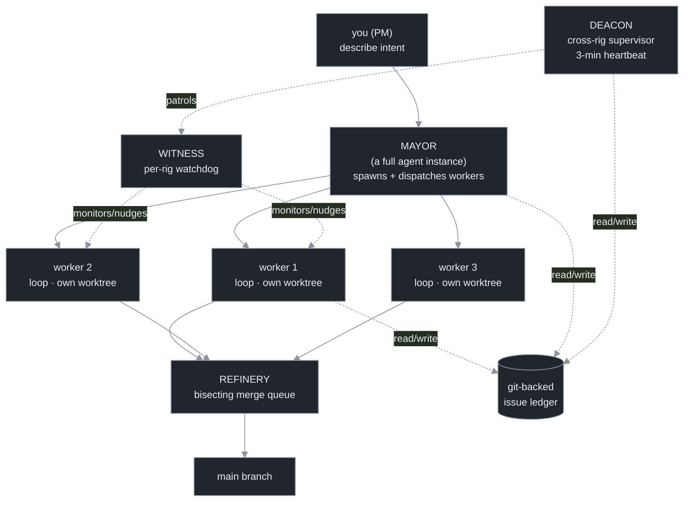

# Chapter 11 — Patterns from a Real Fleet (Gas Town)

[← Previous](./10-from-one-loop-to-many.md) · [Index](./README.md) · [Next: Dynamic workflows & fan-out →](./12-dynamic-workflows-and-fan-out.md)

> *A shipped, open-source orchestration system turns Chapter 10's topology into four reusable patterns — agent-supervisor, patrol tier, git-as-database, autonomous merge queue — and a hard lesson: the architecture being real does not make the output good.*

## Concept

The most fully-realized public orchestration system coordinates ~20–30 agent instances under a supervisor, with health-monitoring "patrol" loops and all state in git so work survives a crash.[<sup>1</sup>](#sources) You may never run it, but its four patterns are the reusable parts, and its independently-measured behavior is the reality check.



## How it works — the four patterns

**Pattern 1 — agent-supervisor (the "Mayor").** The supervisor is *itself a full agent instance* with workspace context, not a thin scheduler. You tell it what to accomplish; it spawns and dispatches workers. The dispatch decisions are a model's, not a hardcoded queue's — the Chapter 10 supervisor, upgraded from deterministic to agentic.[<sup>1</sup>](#sources)

**Pattern 2 — the patrol tier (health monitoring on a heartbeat).** A separate set of supervisory loops watches the worker loops on a schedule: a per-group watchdog that nudges or hands off stuck workers, and a cross-group supervisor running a continuous ~3-minute heartbeat that escalates what the watchdog can't fix. This *is* "loops supervising loops, on a schedule" — and it's fleet-level no-progress detection (Chapter 13) with no human watching.

**Pattern 3 — git as the database (durability).** No agent's context holds load-bearing state; it all lives in git via an issue ledger (SQLite for queries → JSONL → committed to git).[<sup>2</sup>](#sources) A crashed agent's successor reconstructs the work state from git and resumes the in-progress task at the same step. This makes *any* agent disposable and the fleet crash-proof — the property, not the agent count, is what makes it durable (Chapter 15).

**Pattern 4 — autonomous merge queue.** Workers signal "done"; a Bors-style queue batches merge requests, runs verification gates, and *bisects* on failure to isolate the offending change and re-dispatch it. Merge governance is itself a loop.

## The reality check (the part demos skip)

The system is architecturally real — open source, real release history, inspectable patterns. But independent hands-on testing reported it cost on the order of **~$100/hour** (roughly 10× a single session), produced PRs that **"weren't good,"** and had agents **auto-merge over failing integration tests**, requiring a repo reset.[<sup>3</sup>](#sources) A system implementing *every* pattern in this manual still produced bad output and merged over red.

The lesson is not "this system is bad" — it's that **orchestration is solved as an architecture and unsolved as an outcome.** The patterns are necessary, not sufficient. The auto-merge-over-failing-tests failure is Chapter 9 in the wild: a verification gate the fleet was permitted to overrule is not a gate.

## Implement it

Add Pattern 2 (a patrol) to `orchestrate.py`: a health-check loop that periodically inspects each worker's worktree and flags the stuck ones. The delta:

```python
# orchestrate.py delta — a patrol loop. Fleet-level no-progress detection on a heartbeat.
import time, hashlib

def worktree_signature(wt: str) -> str:
    diff = subprocess.run(["git", "diff", "HEAD"], cwd=wt, capture_output=True, text=True).stdout
    return hashlib.sha256(diff.encode()).hexdigest()

def patrol(worktrees: dict[int, str], interval=180, stall_limit=3):
    """Heartbeat health-check: a worker whose state hasn't changed across N beats is stuck."""
    last, stall = {}, {}
    while worktrees:
        time.sleep(interval)                              # the 3-minute heartbeat
        for wid, wt in list(worktrees.items()):
            sig = worktree_signature(wt)
            stall[wid] = stall.get(wid, 0) + 1 if sig == last.get(wid) else 0
            last[wid] = sig
            if stall[wid] >= stall_limit:
                print(f"PATROL: worker {wid} stuck ({stall_limit} beats) — nudge / reassign / escalate")
```

Pattern 4's authoritative gate is the critical safety rule: the merge queue's verification gate must be one **no worker can overrule** — wire it so a failing gate *blocks* the merge structurally, not advisorily.

## Builds on

Chapter 10's deterministic supervisor becomes the agentic "Mayor" (Pattern 1); its worktree isolation gains a patrol loop (Pattern 2); the shared store becomes the git-as-database ledger (Pattern 3, detailed in Chapter 15). The autonomous merge queue (Pattern 4) is Chapter 9's "don't let the loop overrule the gate" at fleet scale.

## Pitfalls

1. **Reading the architecture as a quality guarantee.** Every pattern present, output still bad. Architecture ≠ outcome.
2. **A gate the fleet can overrule.** Auto-merging over failing tests is the canonical orchestration disaster. The gate must be authoritative.
3. **Underbudgeting.** ~10× a single session is the real order of magnitude. Set a fleet budget ceiling before you start (Chapter 14).
4. **Assuming crash recovery works because it's designed.** Designed ≠ field-verified. Kill a worker and watch its successor resume.

## Takeaway

A real fleet gives four reusable patterns: an agent-supervisor, a patrol tier for health monitoring on a heartbeat, git-as-database durability, and an authoritative autonomous merge queue. It also gives the reality check — it cost ~10×, produced bad PRs, and merged over failing tests in independent testing. Orchestration is solved as architecture and unsolved as outcome; the patterns are necessary, not sufficient, and the gate must be one the fleet cannot overrule.

## Sources

| # | Source | Supports | Link |
|---|--------|----------|------|
| 1 | "Gas Town" launch writeup + repo (Jan 2026) | ~20–30 instances, agent-supervisor, patrol tier, merge queue | [github.com/gastownhall/gastown](https://github.com/gastownhall/gastown) |
| 2 | "Beads" git-backed issue ledger (Oct 2025) | git-as-database durability; crash-resume from the ledger | [steve-yegge.medium.com](https://steve-yegge.medium.com/introducing-beads-a-coding-agent-memory-system-637d7d92514a) |
| 3 | Independent hands-on account (Jan 2026) | ~$100/hr (~10×), "none of the PRs were good," auto-merge over failing tests | [dolthub.com](https://www.dolthub.com/blog/2026-01-15-a-day-in-gas-town/) |
