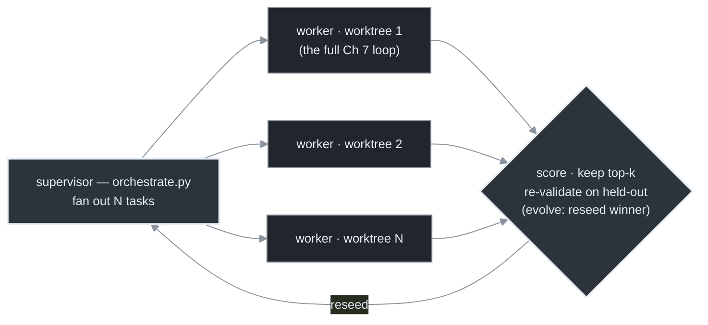
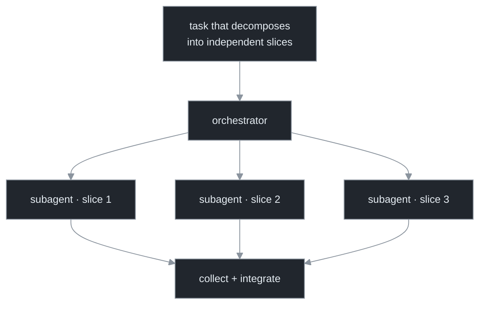
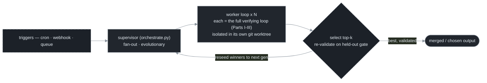

# Chapter 12 — Fan-Out, Dynamic Workflows & Triggers

[← Previous](./11-gastown-and-the-mayor-pattern.md) · [Index](./README.md) · [Next: Making loops halt →](./13-making-loops-halt.md)

> *Orchestration without a separate system: fan out independent work across subagents, let the agent design the orchestration, and wire the loop to triggers that aren't you. The last move — scheduling replaces the human kickoff — completes Part IV.*

<!-- milestone-delta -->
> **Part IV (Orchestration) at a glance — what this chapter adds.** *One* loop becomes *many*: a **supervisor** fans work out to N **isolated workers** (each its own git worktree, each the full verifying loop), then **scores, keeps the top-k, and reseeds the winner** — re-validated on a held-out gate so best-of-N can't crown a fluke.


*Highlighted = what this milestone adds · dashed border = an external dependency (the model, the gate, git/forge); solid = the loop's own code + files.*

## Concept

You don't need a separate fleet system to orchestrate. The harness ships two built-in mechanisms, and underneath them sits the idea that completes the part:[<sup>1</sup>](#sources)

- **Fan-out** — spawn many subagents on independent slices of a task, run them concurrently, collect results.
- **Dynamic workflows** — describe the goal and let the agent *create the workflow* that decomposes and orchestrates the work across many agents, rather than wiring it by hand.
- **Triggers** — the loop body is indifferent to what woke it; once it's trustworthy, you wire it to events instead of starting it yourself.

## How it works

**Fan-out** is the simplest orchestration primitive, and its make-or-break constraint is **independence**:



"Review these 40 files," "convert these 30 modules," "investigate these 12 flaky tests" — each slice is blind to the others, so N subagents finish in roughly the time of the slowest, not the sum. If the slices share state or depend on each other, parallelism reintroduces the collision problem (Chapter 10) and you spend more on coordination than you saved. **Fan out what's independent; sequence what isn't.**

**From blind fan-out to evolutionary search.** Plain fan-out runs N *independent* attempts and keeps the best — which is best-of-N against the gate, and so exposed to the selection inflation of Chapter 9: the winner's green is partly luck. Two richer topologies trade independence for an actual search:

| Topology | How candidates relate | What you keep | Best when |
|---|---|---|---|
| Single-artifact (ralph) | one artifact, refined in place | the latest state | the path is roughly known |
| Independent fan-out | N blind parallel attempts | the best survivor | slices are independent; one good answer suffices |
| Evolutionary | N candidates scored, **winners reseeded** into the next round | a population across generations | the space is wide and a scorer can rank partial progress |

The evolutionary loop is fan-out plus selection plus *cross-pollination*: generate a population, score each against an objective, keep the top-k, feed those winners back as the seed context for the next generation, and repeat. It is how program-search systems discover non-obvious solutions a single pass never reaches.[<sup>4</sup>](#sources)

```python
# evolution.py — fan-out + selection + reseed, built on Chapter 10's run_fleet.
def evolve(seed, score, generations=5, pop=8, keep=2):
    population = [seed]
    for _ in range(generations):
        variants = run_fleet(expand(population, pop))   # fan out a population (Ch 10)
        ranked   = sorted(variants, key=score, reverse=True)
        population = ranked[:keep]                       # keep the winners → seed the next gen
    return population[0]                                 # then re-validate on a HELD-OUT gate (Ch 9)
```

Because it is *repeated* best-of-N against a scorer, the evolutionary loop is the topology most exposed to selection inflation and overfitting — so the held-out acceptance gate (Chapter 9) is not optional here, it is the only thing separating a discovered edge from a whole generation of prettier noise.

**Dynamic workflows** raise the altitude again: instead of *you* choosing the slices and topology, you describe the goal and the agent creates a workflow orchestrating "tens to hundreds of agents."[<sup>1</sup>](#sources) That's the Chapter 1 altitude shift applied to orchestration itself — and exactly where blast radius gets large, so the budget ceiling (Chapter 13) and verification (Part III) are not optional. Design for tens-to-hundreds; the viral "thousands of agents" figures are anecdote, not spec.

**Triggers** are the idea that ties Part IV together. The loop body runs the same `decide → act → verify → commit` cycle regardless of what fired it, so once it's trustworthy you choose the triggers — and at scale you choose the ones that aren't you:

| Trigger | Example | Who starts it |
|---|---|---|
| Human message | you type a prompt | you |
| Heartbeat | a periodic tick (a patrol, every 3 min) | infrastructure |
| Cron | `/loop`, Codex Automations | infrastructure |
| Git / CI hook | a PR comment, a failed build | an event |
| Webhook | an external HTTP call | an event |

This is **infrastructure time** instead of **attention time**: you wire the triggers once and the system runs itself — work arrives, the loop wakes, does it, verifies, sleeps. That's why durability (Chapter 15) and safety (Chapter 16) come next: a loop that runs without you watching had better survive a crash and had better not be able to do catastrophic damage.

## Implement it

The fan-out delta to `orchestrate.py` is a bounded pool over independent slices (`run_fleet` from Chapter 10 already does this). The new piece is **trigger wiring** — making the same loop fire from an event instead of a person:

```python
# trigger.py — wire the SAME loop body to a trigger that isn't you. Cron example.
import loop

def on_trigger(repo: str, gate: str):
    """The loop body doesn't care that cron/CI/a webhook called it instead of a human."""
    cfg = loop.Config(repo=repo, gate_cmd=gate, max_iter=30, budget_usd=10.0)  # stops from Ch 13/14
    reason = loop.run_loop(cfg)
    if reason != "done":
        notify_human(reason)        # a safety halt needs attention; 'done' is silent success

# crontab:  0 * * * *  cd /repo && python3 trigger.py   # hourly, unattended
# or a CI webhook / GitHub event calls on_trigger() on a PR comment or red build.
```

In the harness this is `/loop` (cron) or Routines (cloud events); the point is harness-agnostic — *which triggers should wake this loop, and which of them are you?* Note `on_trigger` only pages a human on a non-`done` terminal: success is silent, safety-halts escalate (Chapter 13's stop-reasons).

## Builds on

Chapter 10's `run_fleet` is the fan-out; this chapter adds dynamic workflows (the agent designs the fan-out) and triggers (the fan-out fires from events). The `notify_human(reason)` call consumes the stop-reason terminals that Chapter 13 formalizes. Triggers are what make the durability and safety of Part V necessary rather than optional.

## Pitfalls

1. **Fanning out dependent work.** Slices that share state turn parallelism into a coordination tax. Fan out the independent; sequence the dependent.
2. **A dynamic workflow with no budget ceiling.** "Orchestrate hundreds of agents" with no cap is the runaway failure at fleet scale. Cap it first (Chapter 13).
3. **Designing for "thousands of agents."** First-party reality is tens-to-hundreds. Build for that.
4. **Wiring triggers before the loop body is trustworthy.** Event-driven autonomy multiplies the loop's behavior — good *or* bad — across every trigger. Make the loop verify itself (Chapter 7) before cron and webhooks fire it.
5. **Keeping the best of N without re-validating it.** Fan-out + keep-best is best-of-N; the winner's score is inflated by selection, more so as N grows (Chapter 9). Re-check the survivor on a held-out gate before you trust it — doubly so for an evolutionary loop, which compounds the effect every generation.

## Takeaway

Fan out independent slices across subagents; let dynamic workflows decompose what's complex; and once the loop body verifies itself, wire it to triggers that aren't you — heartbeat, cron, events. That's infrastructure time replacing attention time, and it's exactly why durability and safety come next.

<!-- milestone-cumulative -->
## The loop so far — Part IV: the orchestrated fleet

Triggers feed a supervisor that runs many copies of the Part III loop in physical isolation, selecting and reseeding across generations. The single-loop guarantees hold inside each worker; the supervisor adds selection on top.


*Dashed = external dependency (the model, the gate, git/forge); solid = the loop's own code + files.*

## Sources

| # | Source | Supports | Link |
|---|--------|----------|------|
| 1 | Claude Code CHANGELOG (v2.1.154+) | dynamic workflows ("tens to hundreds of agents"); subagent nesting | [github.com/anthropics/claude-code](https://raw.githubusercontent.com/anthropics/claude-code/refs/heads/main/CHANGELOG.md) |
| 2 | Cloud Routines / triggers docs | unattended runs on schedule, GitHub event, or HTTP trigger | [platform.claude.com](https://platform.claude.com/docs/en/api/claude-code/routines-fire) |
| 3 | Companion curriculum, `agents/29-modern-patterns.md` | the five-trigger event-loop framing (one loop body, many triggers) | [local](../agents/29-modern-patterns.md) |
| 4 | FunSearch (Nature 2023); AlphaEvolve (DeepMind, 2025) | the evolutionary topology — population + scorer + reseed winners — discovers solutions a single pass misses | [nature.com/s41586-023-06924-6](https://www.nature.com/articles/s41586-023-06924-6) · [deepmind.google](https://deepmind.google/blog/alphaevolve-a-gemini-powered-coding-agent-for-designing-advanced-algorithms/) |
