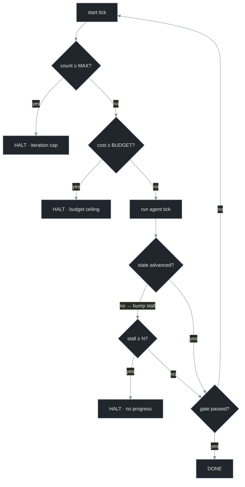

# Chapter 13 — Making Loops Halt

[← Previous](./12-dynamic-workflows-and-fan-out.md) · [Index](./README.md) · [Next: The economics of loops →](./14-the-economics-of-loops.md)

> *A loop's defining feature — a model decides whether to continue — is also its defining danger: a confused model can decide to continue forever. Most of loop engineering is making the loop stop. This is the chapter that hardens the placeholder cap into a real harness.*

## Concept

The most-feared production failure is the loop that doesn't stop: unbounded iterations and billing surprises orders of magnitude over budget.[<sup>1</sup>](#sources) Every serious loop converges on the same **three hard stops**, and they are mandatory, not advanced:

1. **Maximum iteration count** — bounds *count*.
2. **No-progress detection** — bounds *wasted motion*.
3. **Budget ceiling** — bounds *money*.

A loop without all three is not a loop you can run unattended; it's an unbounded bill with a model in the body. These are *safety* terminals; the completion gate (Chapter 6–7) is the *success* terminal. There are three ways to stop safely and one to succeed, and a robust loop treats all four as first-class — recording which fired, because "I finished" and "I gave up safely" mean very different things.

## How it works

Evaluate the stops as a precedence each tick — cheap checks first, then work, then the success check:



**Iteration cap** is the universal backstop — bounds count, not cost or value, so it's necessary but never sufficient alone. **Budget ceiling** bounds money directly and must be enforced *structurally by your harness*, not requested of the model ("be mindful of cost" is not a ceiling; "the harness kills the process at $20" is); enforce it at the **fleet** level too, since one runaway worker is invisible when each tick looks cheap. **No-progress detection** is the hard one — it catches the loop that's *stuck*: iterating, spending, and not advancing. The signal is repetition — an empty/unchanged diff, the same error N times, an unchanged state hash. There's no canonical algorithm;[<sup>2</sup>](#sources) the difficulty is distinguishing "productively thinking" (a tick that researches without editing) from "actually stuck," so detect unchanged *state* over several ticks, not lack of edits on one.

## Implement it

This is the chapter that turns the placeholder `for i in range(cfg.max_iter)` into the real harness. The three stops, a stop-reason enum, and the no-progress state signature — the core of the capstone `loop.py`:

```python
# loop.py delta — the three hard stops replace the placeholder loop bound.
import enum, hashlib

class StopReason(str, enum.Enum):
    DONE = "done"                     # success
    ITERATION_CAP = "iteration_cap"   # safety
    BUDGET_CEILING = "budget_ceiling" # safety
    NO_PROGRESS = "no_progress"       # safety

def state_signature(cfg) -> str:
    diff = subprocess.run(["git", "diff", "HEAD"], cwd=cfg.repo,
                          capture_output=True, text=True).stdout
    return hashlib.sha256(diff.encode()).hexdigest()   # unchanged across a tick == no progress

def run_loop(cfg) -> StopReason:
    spent, stall, last_sig, feedback = 0.0, 0, state_signature(cfg), None
    for i in range(1, cfg.max_iter + 1):               # STOP 1: iteration cap
        if spent >= cfg.budget_usd:                    # STOP 2: budget ceiling (before spending)
            return _halt(StopReason.BUDGET_CEILING, i)
        spent += run_agent_tick(cfg, feedback)         # build_prompt + run_agent + cost (Ch 5, 14); assembled as run_agent() in the capstone
        sig = state_signature(cfg)
        if sig == last_sig:                            # STOP 3: no-progress detection
            stall += 1
            if stall >= cfg.no_progress_n:
                return _halt(StopReason.NO_PROGRESS, i)
        else:
            stall = 0                                  # progress resets the counter
        last_sig = sig
        gate = verification_gate(cfg)                  # SUCCESS check (Ch 7)
        if gate.passed:
            return _halt(StopReason.DONE, i)
        feedback = gate.feedback
    return _halt(StopReason.ITERATION_CAP, cfg.max_iter)

def _halt(reason: StopReason, tick: int) -> StopReason:
    level = "INFO" if reason is StopReason.DONE else "WARN"
    log(level, "loop", "HALT", reason=reason.value, tick=tick)   # record WHICH terminal fired
    return reason
```

The `_halt` log line is what makes a fleet observable: `grep reason=` reconstructs every run's outcome, and a supervisor (Chapter 11's patrol) reads exactly this to tell success from a halt that needs a human.

## Builds on

Chapter 7's `run_loop` had a placeholder `for i in range(cfg.max_iter)` and returned a bare string; this replaces it with the three-stop precedence, a `StopReason` enum, and the no-progress `state_signature`. The cost figure (`run_agent_tick` returning a measured cost) is wired up in Chapter 14. This is now the `run_loop` the orchestrator (Chapter 10) runs in every worker.

## Pitfalls

1. **Shipping with only the iteration cap.** The cap bounds count, not cost or value — you still get expensive no-progress runs within it. All three, always.
2. **A budget the model is asked to respect.** "Be mindful of cost" is not a ceiling. Kill the process at the limit, in your code.
3. **No-progress detection that punishes thinking.** Halting on the first no-edit tick kills loops that are legitimately researching. Use unchanged *state* over several ticks.
4. **Halting without recording why.** Undifferentiated "stopped" hides success from giving-up. Log the terminal.
5. **Per-worker limits with no fleet limit.** Each tick looks cheap while the fleet bleeds. Enforce the budget at the aggregate.

## Takeaway

Most of loop engineering is making the loop stop. The three hard stops — iteration cap, no-progress detection, budget ceiling — are mandatory. The cap bounds count; the budget bounds money and must be enforced structurally by your harness (and at the fleet level); no-progress bounds wasted motion and is the judgment-heavy one (detect unchanged *state* over several ticks). Compose them as safety terminals ahead of the success check, and always record which terminal fired.

## Sources

| # | Source | Supports | Link |
|---|--------|----------|------|
| 1 | Production accounts of unbounded loops (2026) | infinite loops and billing surprises are the primary failure mode | reported across 2026 practitioner discourse |
| 2 | Loop-engineering practitioner guide (2026) | the "same error / empty diff / failing test N×" no-progress heuristic (a blog pattern, not a standard) | [explainx.ai](https://explainx.ai/blog/loop-engineering-coding-agents-claude-code-guide-2026) |
| 3 | Companion curriculum, `agents/05`, `agents/21` | the inner-loop recursion limit; tool loops as the cost center | [local](../agents/05-execution-loop.md) |
