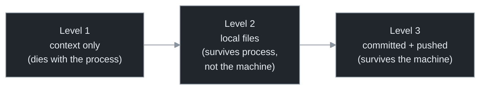

# Chapter 15 — Durability & Crash Recovery

[← Previous](./14-the-economics-of-loops.md) · [Index](./README.md) · [Next: Permissions & safety →](./16-permissions-and-safety.md)

> *A loop that runs unattended for days will be interrupted. Durability means an interruption costs at most one tick of work — and the discipline that delivers it is the same one that beats context rot.*

## Concept

**Durability** is the property that a crash — laptop sleep, dropped SSH, recycled cloud box, OOM — costs you at most the single in-flight tick, not the whole run. The discipline that delivers it is identical to the fresh-context discipline from Chapter 5, asked from the other direction:

> **Fresh-context question (Ch 5):** could the next tick pick up using only the files on disk?
> **Durability question (Ch 15):** if the process died right now and restarted from nothing, could it pick up using only the files on disk?

Same answer, same requirement: **no load-bearing state in any agent's context.** If the loop's memory lives only in a conversation, both rot *and* a crash destroy it. If it lives in git and files, both are non-events. This is why fresh-context discipline came early — it was durability in disguise.

## How it works

Not all "state in files" is equally durable:



The rule: **commit every tick, push for Level 3.** The commit is the checkpoint; git is the durable store; the commit message plus the plan file form the resume point. Generalized, this is "git is the database" — when the work queue and progress ledger themselves live in git, crash recovery is automatic and fleet-wide: any agent can die and its successor reads the ledger and continues.[<sup>1</sup>](#sources)

Two further properties make recovery real:

- **Resumability.** The loop must *use* the durable state on restart: orient from the plan file and git log every tick, so a cold restart is just another tick. Fresh-context loops get this for free — there's no separate "recovery mode," because every tick already rebuilds from disk.
- **Idempotency.** A crash can land mid-action (half a file, a commit not pushed, 3 of 5 files migrated). Make each tick atomic where possible (one commit, written only after the work *and* its verification pass), check before acting ("add the field if absent," not "add the field"), and treat the working tree as recoverable (on restart, `git status` reveals a mess; reset to the last clean commit and re-derive, since the spec, not the diff, is the source of truth — Chapter 4).

Finally, *where* the loop runs decides what "survives a restart" means: **attention time** (your machine, or remote-controlled but still on your machine — dies with your process) vs **infrastructure time** (managed cloud Routines, unattended on schedule/event — uptime decoupled from yours).[<sup>2</sup>](#sources) Cloud + Level-3 durability is what lets you genuinely walk away — which is why the safety chapter follows.

## Implement it

Add per-tick durable commits and disk-based resume to `loop.py`. The delta:

```python
# loop.py delta — durable checkpoint each tick; resume from git alone.
def commit_progress(cfg, tick: int) -> None:
    """Level-3 durability: one commit per tick so a crash costs at most one tick (push for off-machine)."""
    subprocess.run(["git", "add", "-A"], cwd=cfg.repo)
    if subprocess.run(["git", "diff", "--cached", "--quiet"], cwd=cfg.repo).returncode:
        subprocess.run(["git", "commit", "-m", f"loop: tick {tick}"], cwd=cfg.repo)
        if cfg.push:
            subprocess.run(["git", "push", "-u", "origin", cfg.branch], cwd=cfg.repo)  # branch-only (Ch 16)

# In run_loop, call commit_progress(cfg, i) right after the agent tick — BEFORE the gate —
# so even a crash mid-verification leaves a clean committed checkpoint to resume from.
```

Resume needs no special code in a fresh-context loop: `build_prompt` (Chapter 5) already reads the plan file and the agent reads the git log each tick, so restart is indistinguishable from a normal tick. The only addition is making the *first* tick after a restart reconcile a dirty tree (`git stash` or reset to `HEAD`), which the idempotency rule handles.

## Builds on

Chapter 5's fresh-context invariant *is* the durability mechanism, viewed from the crash side; this chapter adds `commit_progress` (the checkpoint) to the `run_loop` that Chapter 13 hardened. Branch-only push anticipates Chapter 16's blast-radius containment. A durable worker is what makes the orchestration of Part IV crash-proof.

## Pitfalls

1. **Load-bearing state in the conversation.** A crash (and rot) destroys it. State goes in git and files.
2. **Committing but not pushing.** Level 2, not Level 3 — survives the process, not the machine. Push, or accept a recycled box loses the run.
3. **No resume logic.** A loop that can't tell it's restarting re-does completed work or skips incomplete work. Orient from disk every tick.
4. **Non-idempotent ticks.** A crash mid-action plus a naive re-run double-applies. Atomic ticks, check-before-acting.
5. **Believing designed durability is verified durability.** Kill a worker and watch the successor resume — or you don't actually know.

## Takeaway

Durability is surviving a restart with at most one tick of lost work, and it's the same discipline as fresh context: no load-bearing state in any agent's conversation. Commit (and push) every tick for Level-3 durability; let the loop orient from disk every tick so resumability is free; make ticks idempotent so a mid-action crash is recoverable. Choose infrastructure-time execution when you need to walk away — and verify durability by actually crashing it.

## Sources

| # | Source | Supports | Link |
|---|--------|----------|------|
| 1 | "Beads" git-backed issue ledger (Oct 2025) | "git is the database"; crash-resume; fleet-wide recovery | [steve-yegge.medium.com](https://steve-yegge.medium.com/introducing-beads-a-coding-agent-memory-system-637d7d92514a) |
| 2 | Cloud Routines vs Remote Control docs | infrastructure-time (managed cloud) vs attention-time (your machine) | [platform.claude.com](https://platform.claude.com/docs/en/api/claude-code/routines-fire) |
| 3 | Companion curriculum, `agents/12-state-recovery.md` | checkpointers, idempotent resume in depth | [local](../agents/12-state-recovery.md) |
