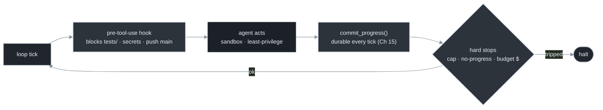
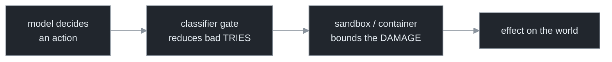
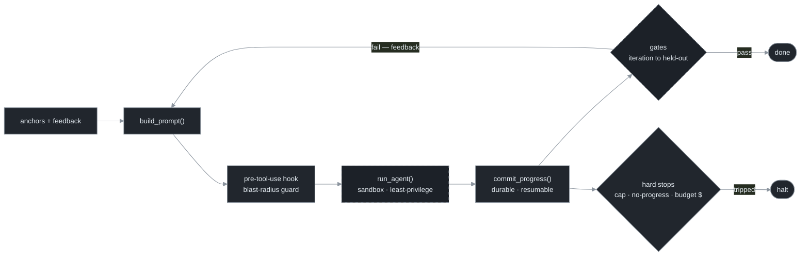

# Chapter 16 — Permissions & Safety for Autonomous Loops

[← Previous](./15-durability-and-crash-recovery.md) · [Index](./README.md) · [Next: It's not loops, it's skills →](./17-its-not-loops-its-skills.md)

> *The more thoroughly a loop runs without you, the more it matters what it's allowed to do without you. Autonomy and blast radius are the same dial; set it deliberately, and let the loop own what's reversible while gating what isn't.*

<!-- milestone-delta -->
> **Part V (Production) at a glance — what this chapter adds.** The loop gets a **production envelope**: the three **hard stops** (cap · no-progress · budget) so it always halts, **`commit_progress()`** so a crash costs one tick not the run, and a **pre-tool-use hook + sandbox** so the *blast radius* is something you set, not discover.


*Highlighted = what this milestone adds · dashed border = an external dependency (the model, the gate, git/forge); solid = the loop's own code + files.*

## Concept

Every prior chapter pushed toward more autonomy: stop prompting, schedule it, fan it out, run it in the cloud, make it crash-proof. This chapter is the counterweight: an unattended loop can do unattended damage, and the amount it *can* do — its **blast radius** — is something you set, not something you discover after the fact. The core tension is unavoidable: a loop that asks permission on every action isn't autonomous; a loop that asks on nothing can do anything. Loop safety is engineering that trade — and it *will* sometimes go wrong (recall the fleet that auto-merged over failing tests, Chapter 11), so the question is never "will it ever err" but "what's the worst it can do when it does."

## How it works

Enumerate the blast radius across four axes before any unattended run, and grant **least privilege** — exactly what the task needs, no more:

| Axis | The question | Containment |
|---|---|---|
| Filesystem | read/write what? outside the repo? secrets? | sandbox/container; `.agentignore`; restricted user |
| Commands | execute what? `rm -rf`? `curl \| sh`? deploy? | command allowlist; pre-tool-use hooks |
| Version control | push where? force-push? merge to main? | feature branches only; protected `main` |
| Money & external | spend? send email? hit prod APIs? | budget ceiling (Ch 13); no prod creds; dry-run |

Granting permissions "just in case" is pure downside: an unused permission can't help the task and only widens the radius.

Two layers of control, mapping to the two ways a loop goes wrong:

- **Classifier-gating ("auto mode")** — instead of disabling all approval checks, route routine approvals through model classifiers with tiered allowlisting, so reads and in-project edits bypass the gate and only high-risk actions hit it.[<sup>1</sup>](#sources) This *reduces bad tries* but is **not a sandbox** — it gates decisions, it doesn't isolate execution.
- **Sandboxing** — OS-level isolation (filesystem, network, process) that *bounds the damage* whatever the model decides. A structural control, not a probabilistic one.



For orchestration, per-worker isolation does double duty: the worktree/container that prevents collisions (Chapter 10) also bounds each worker's radius. And a specific risk worsens with autonomy: loops read untrusted input (PR comments, issue bodies, web pages, dependencies), any of which can carry a **prompt injection** to hijack the agent.[<sup>2</sup>](#sources) The defense is the same blast-radius containment — least privilege means even a hijacked loop can't reach prod or exfiltrate secrets it was never given.

## Implement it

Safety is mostly *configuration* — a least-privilege agent command, branch-only writes, and a pre-tool-use hook that makes the dangerous actions physically unavailable. The `loop.py` config + a hook:

```python
# loop.py — least-privilege defaults (Config). acceptEdits, NOT --dangerously-skip-permissions.
agent_cmd = "claude -p --permission-mode acceptEdits --model {model}"  # gated, not skip-all
branch    = "loop/work"   # branch-only; never pushes to main
push      = True          # to the feature branch only
# blast radius: no prod creds in env, budget_usd capped (Ch 13), repo-scoped filesystem
```

```bash
# .claude/hooks/pre-tool-use.sh — make the cheats and catastrophes physically impossible (Ch 9, Ch 16).
# Block edits to tests (anti-gaming), to secrets, and any push to main.
case "$TOOL_INPUT" in
  *tests/*|*__tests__/*)   echo "blocked: loop may not edit tests"; exit 1 ;;   # Ch 9 anti-gaming
  *.env*|*id_rsa*|*secrets*) echo "blocked: secrets are out of blast radius"; exit 1 ;;
  *"git push"*"main"*)     echo "blocked: no pushes to main"; exit 1 ;;
esac
exit 0
```

A hook the loop *cannot* bypass is stronger than any instruction in the prompt — it converts "please don't" into "you can't."

**Never let an unattended loop:** push/merge to `main`, hold prod credentials or deploy, run uncapped budget, execute fetched code without isolation, or operate outside the task's repo. Keep the *irreversible, high-consequence* actions (prod, main, spend, infra) behind a human or a non-overridable gate; let the loop own the *reversible, contained* work (edits on a branch, tests, PRs). **Reversibility is the dividing line.**

## Builds on

Chapter 13's budget ceiling is the "money" axis of the blast radius; Chapter 15's branch-only push is the "version control" axis; Chapter 9's "don't let the loop edit the tests" becomes a pre-tool-use hook here. The worktree isolation from Chapter 10 is the same control that bounds each worker's radius. This chapter is the safety layer that makes the unattended, scheduled, cloud-run loop of Part IV acceptable to actually run.

## Pitfalls

1. **Granting permissions "just in case."** Unused permissions are pure blast radius with no upside. Least privilege.
2. **Treating auto mode as a sandbox.** It gates decisions, not execution. Add a sandbox for high-autonomy loops.
3. **Letting the loop reach production.** Coding loops end at the PR. Prod and main merges stay human-gated (or behind a gate the loop can't overrule).
4. **Ignoring injection because "it's just my repo."** Loops read PR comments, issues, web pages, dependencies — all untrusted. Least privilege plus isolation is the defense.
5. **Skipping containment because the run is unattended.** "Unattended" is the reason to bound the radius *more*, not to skip it.

## Takeaway

Autonomy and blast radius are the same dial. Enumerate the radius across filesystem, commands, version control, and money, and grant least privilege. Classifier-gating reduces bad *tries*; sandboxing bounds the *damage* — use both for high autonomy. Treat all loop-ingested content as untrusted, and keep irreversible actions — prod, main, credentials, spend — behind a human or a non-overridable gate. Let the loop own what's reversible; gate what isn't.

<!-- milestone-cumulative -->
## The loop so far — Part V: the production-grade loop

The verifying loop now runs least-privilege behind a non-bypassable hook, commits durably every tick (resumable from git), and is bounded on every axis — it reaches done, or it halts on a stop you chose; it never runs away or escapes its radius.


*Dashed = external dependency (the model, the gate, git/forge); solid = the loop's own code + files.*

## Sources

| # | Source | Supports | Link |
|---|--------|----------|------|
| 1 | "How we built Claude Code auto mode" (Mar 2026) | classifier-gated approvals, tiered allowlisting, "without traditional sandboxing" | [anthropic.com/engineering](https://www.anthropic.com/engineering/claude-code-auto-mode) |
| 2 | OWASP LLM Top 10; companion `agents/20`, `claude-code/24` | prompt injection against agents reading untrusted content; capability/content separation | [owasp.org](https://owasp.org/www-project-top-10-for-large-language-model-applications/) |
| 3 | Companion curriculum, `claude-code/07-permission-modes.md` | permission-mode mechanics; sandboxing as a separate control | [local](../claude-code/07-permission-modes.md) |
