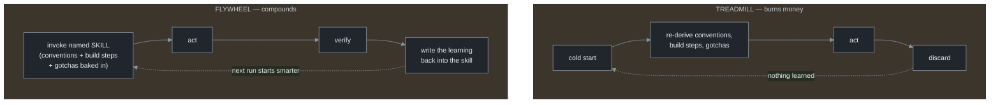

# Chapter 17 — It's Not Loops, It's Skills

[← Previous](./16-permissions-and-safety.md) · [Index](./README.md) · [Next: Anti-patterns & the decision framework →](./18-anti-patterns-and-decision-framework.md)

> *The loop is plumbing. The reusable, named, tested skill it calls is the compounding asset. You can build every guardrail in this manual perfectly and still burn money forever — if every tick re-derives from a cold start.*

## Concept

A guideline worth making structural:

> **If you do something more than once, turn it into a skill. If you do something hard, turn it into a skill afterward so next time is free.**[<sup>1</sup>](#sources)

Put it together with everything so far and you get the real claim of loop engineering: the loop is plumbing; the reusable, named, tested skill it calls is the asset. A loop with no reusable skills is a while-true around a stranger — every tick it re-discovers your build command, re-learns that the auth module is fragile, re-guesses the convention it violated last time. A loop that calls a library of sharp, named skills **compounds**: the hard-won knowledge lives in the skill, not in a context that gets discarded each tick.

## How it works

The difference between a system that compounds and one that burns money is one structural feature — the **write-back edge**:



A **treadmill** loop re-derives everything every cold session and pays tokens to do it, every tick, with no asset to show for it. A **flywheel** loop calls a skill where the intent is written down once on the outside, and folds each run's learnings back in, so the next run starts where the last left off. This is "compound engineering": each unit of work should make the next *easier* by codifying learnings into reusable instructions, and the explicit write-back step is what separates it from a plain ReAct loop.[<sup>2</sup>](#sources) That edge does not happen for free — you build it deliberately, which is why most loops are treadmills.

In the harness, a skill is a `SKILL.md` — a named, versioned, tool-scoped (least-privilege, Chapter 16) unit the loop calls like a function. The loop is the driver; the skill is the capability. "Babysit my PRs" is the loop; "how we review a PR here," "how we run the suite," "how we write a migration" are skills it invokes. Skills are how a loop stops being generic and starts knowing *your* codebase — which is most of the value, because the generic capability is the cheap, commoditized part. (Codex's analogue is `AGENTS.md` plus prompt files — less formalized, same move.)

A precondition worth naming: the model has to be good enough at long-horizon, cold-start work for any of this to hold. Earlier-generation models lost the thread over hundreds of steps, which is why unbounded loops failed in 2023. Current long-horizon models — a 1M-token context, self-verification at high effort — are what flipped loops from "burns money chasing its tail" to "trustworthy overnight."[<sup>3</sup>](#sources) That self-verification reduces how often the external gate must fire; it does not remove the need for it (Chapter 7). Harness and model are complements, not rivals — skills are what make the *harness* half compound.

## Implement it

Make the loop invoke a skill and write a learning back. The `loop.py` delta + a minimal skill file:

```python
# loop.py delta — the loop calls a SKILL and folds learnings back (the flywheel edge).
def build_prompt(repo: str, feedback: str | None = None) -> str:
    base  = pathlib.Path(repo, "PROMPT.md").read_text()
    skill = pathlib.Path(repo, ".claude/skills/ship-pr/SKILL.md").read_text()  # the named capability
    base += f"\n\n## Skill: ship-pr\n{skill}\n"
    if feedback:
        base += f"\n\n## Verification feedback\n{feedback}\n"
    return base

def write_back(repo: str, learning: str) -> None:
    """The flywheel edge: append a hard-won lesson to the skill so the NEXT run starts smarter."""
    skill = pathlib.Path(repo, ".claude/skills/ship-pr/SKILL.md")
    skill.write_text(skill.read_text() + f"\n- Learned: {learning}\n")
```

```markdown
<!-- .claude/skills/ship-pr/SKILL.md — the compounding asset the loop calls -->
---
name: ship-pr
allowed-tools: Bash(npm *), Bash(git *)   # least privilege (Ch 16)
---
# How we ship a PR in this repo
- Build: `npm run build`; test: `npm test`; typecheck: `npm run typecheck` (gate, Ch 7)
- Never edit files under `generated/` or `tests/` (Ch 9, Ch 16)
- Learned: the `auth/` module's tests need `REDIS_URL` set or they hang
```

The single line that matters is `write_back`: without it the loop re-derives "auth tests need REDIS_URL" every cold start; with it, that lesson is paid for once.

## Builds on

Chapter 5's `build_prompt` now loads a *skill* alongside the anchor files, and the verification of Chapter 7 produces the learnings that `write_back` folds in. The least-privilege `allowed-tools` is Chapter 16's containment at the skill level. This is the layer that makes the whole hardened `loop.py` get *cheaper and better* over time instead of merely *not breaking*.

## Pitfalls

1. **Building treadmill loops.** A loop that re-derives everything every tick runs hard and accumulates nothing. Add the write-back edge.
2. **Prompts where skills belong.** A clever prompt you retype is not an asset. The reusable unit is a *file* — named, versioned, callable.
3. **Skills with no tests.** An untested skill that drifts wrong silently poisons every loop that calls it. Skills are code; test them.
4. **Assuming the model makes external verification optional.** Better self-verification reduces how often the gate fires; it doesn't remove the gate (Chapter 7).

## Takeaway

The loop is plumbing; the reusable, named, tested skill it calls is the compounding asset. The structural difference between a flywheel and a treadmill is the write-back edge: fold each run's learnings back into the skills and the loop gets cheaper and better; re-derive from a cold start every tick and it runs in place. Skills are how a loop stops being generic and learns *your* codebase — and a long-horizon model is the precondition that makes it work now.

## Sources

| # | Source | Supports | Link |
|---|--------|----------|------|
| 1 | "Turn it into a skill" doctrine (2026) | the two-sentence skill heuristic; "stop being the thing in the loop" | [explainx.ai](https://explainx.ai/blog/loop-engineering-coding-agents-claude-code-guide-2026) |
| 2 | "Compound Engineering" (Jan 2026) | each unit of work makes the next easier; the explicit Compound/write-back step | [every.to](https://every.to/guides/compound-engineering) |
| 3 | Claude Fable 5 / Mythos 5 announcement (Jun 9 2026) | long-horizon agentic work: 1M context, self-verification at high effort (benchmark percentages unverified, omitted) | [anthropic.com/news](https://www.anthropic.com/news/claude-fable-5-mythos-5) |
