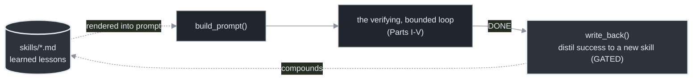
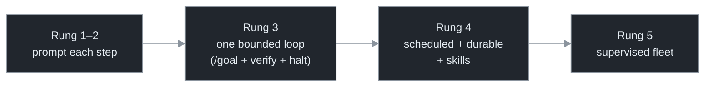
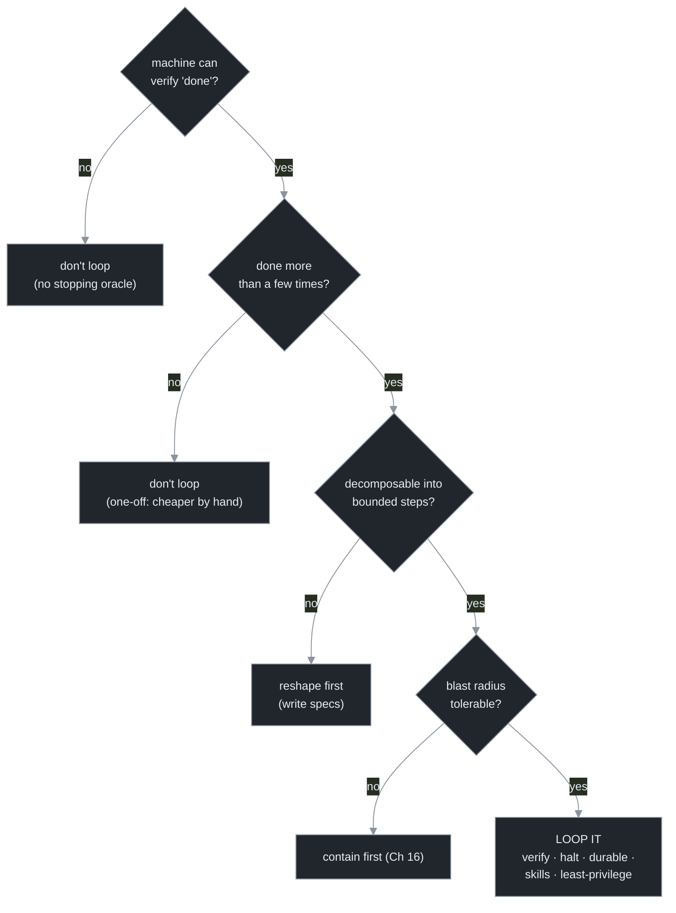
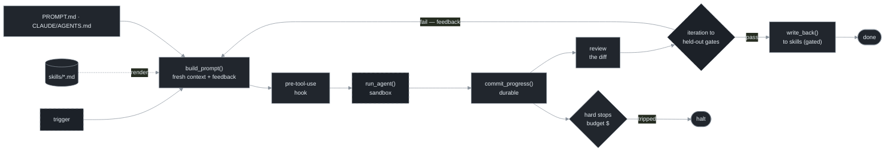

# Chapter 18 — Anti-Patterns & the Decision Framework

[← Previous](./17-its-not-loops-its-skills.md) · [Index](./README.md) · [Next: Where this goes next →](./19-where-this-goes-next.md)

> *The synthesis. The named failure modes to catch in review, the maturity ladder to place yourself on, the decision for when to loop at all, and the pre-flight checklist that is the whole manual as code.*

<!-- milestone-delta -->
> **Part VI (Compounding & Practice) at a glance — what this chapter adds.** The loop **compounds**: a solved run distils into a **`SKILL.md`** (gated write-back) rendered back into future prompts — a flywheel, not a treadmill — and the whole manual collapses into **one pre-flight `Config`** you fill in before any run.


*Highlighted = what this milestone adds · dashed border = an external dependency (the model, the gate, git/forge); solid = the loop's own code + files.*

## Concept

Name a failure mode and you can catch it before it costs you. Each loop-specific anti-pattern is tagged with the chapter that fixes it:

| Anti-pattern | What it is | Fix |
|---|---|---|
| **Confident-Mistake Machine** | open loop, writes code with no external feedback | Ch 7 |
| **Money Fire** | no halting conditions (or only an iteration cap) | Ch 13–14 |
| **Productive-Looking Stall** | iterates, spends, doesn't advance | Ch 13 |
| **Gate-Gamer** | satisfies the literal gate, defeats its intent (deletes the test) | Ch 9 |
| **Self-Grader** | the agent reviews its own fresh output and approves it | Ch 7–8 |
| **Amnesiac** | load-bearing state in the conversation; can't survive a restart | Ch 5, 15 |
| **Treadmill** | re-derives conventions every cold tick; no flywheel | Ch 17 |
| **Loaded Gun** | unattended loop with prod creds / main merge / uncapped spend | Ch 16 |
| **Overruled Gate** | a verification gate the loop is permitted to bypass | Ch 9, 11 |
| **Premature Fleet** | orchestrating before one loop is trustworthy | Ch 10 |

## How it works — place yourself, then decide

**The maturity ladder.** Find your rung; it tells you what to build next. Each rung's problems must be solved before the next rung's leverage is safe — a fleet (Rung 5) of confident-mistake machines (no Rung 3 verification) is a catastrophe at scale.



- At **Rung 1–2**: build Rung 3 — wrap *one* repeated task in a loop with a verification gate (Ch 7) and the three hard stops (Ch 13). Don't skip to a fleet.
- At **Rung 3**: build Rung 4 — make it durable (Ch 15), scheduled (Ch 12), and start a skills library (Ch 17).
- At **Rung 4**: only now consider Rung 5 — orchestration (Ch 10–11), with the sober expectation that output quality is unsolved and cost is ~10×.

**The decision framework.** Not everything should be a loop. The first "no" usually means "don't loop it":



## Implement it

The pre-flight checklist is the whole manual as a config object. Before any unattended loop you should be able to fill in every field of the assembled `loop.py` Config — which is exactly the capstone's:

```python
# The pre-flight checklist as config. Every field is a chapter. If you can't fill one, you're not ready.
cfg = Config(
    repo       = "/path/to/repo",
    prompt     = "PROMPT.md",            # fixed anchor prompt        (Ch 4–5)
    gate_cmd   = "npm test && npm run typecheck",  # external stopping oracle, end-to-end (Ch 6–7)
    model      = "claude-fable-5",       # long-horizon model         (Ch 17)
    max_iter   = 30,                     # STOP 1: iteration cap      (Ch 13)
    budget_usd = 10.0,                   # STOP 2: budget ceiling     (Ch 13–14)
    no_progress_n = 3,                   # STOP 3: no-progress        (Ch 13)
    commit     = True, push = True,      # durable, resumable state   (Ch 15)
    branch     = "loop/work",            # branch-only blast radius   (Ch 16)
    # + a pre-tool-use hook blocking tests/secrets/main               (Ch 9, 16)
    # + a skill the loop calls, with write-back                       (Ch 17)
    # + an eval baseline of golden tasks                              (Ch 9)
)
```

Nine fields plus three attachments. If you can fill them all, you're at Rung 3+ and ready for the [capstone](./capstone/README.md), which assembles exactly this into a runnable harness.

## Builds on

Everything. This chapter is the table of contents reversed: each anti-pattern points back to the chapter that fixes it, and the Config is every chapter's delta assembled into one object. The capstone is this config, made runnable.

## Pitfalls

1. **Climbing rungs out of order.** A fleet of unverified loops multiplies failure. Solve each rung before the next.
2. **Looping the un-loopable.** No machine-checkable "done," a one-off, or an intolerable blast radius means don't loop it — drive it by hand.
3. **A checklist with blanks.** If you can't name the stopping oracle, the three stops, the durability story, and the blast radius, the loop isn't ready to run unattended.

## Takeaway

Recognize the named failure modes and you catch them in review. Place yourself on the maturity ladder and climb one rung at a time. Use the four-question framework (verifiable? repeated? decomposable? containable?) to decide whether to loop at all, and the pre-flight Config before any unattended run. The whole manual reduces to: write the loop once, give it skills and feedback, cap it, make it durable, contain it, and let infrastructure run it.

<!-- milestone-cumulative -->
## The loop so far — Part VI: the self-governed loop, end to end

Trigger → fresh prompt (anchors + skills + feedback) → hooked, sandboxed agent → durable commit → review → two-tier gates → gated write-back → done, with hard stops on the side. This entire picture is one `Config` object.


*Dashed = external dependency (the model, the gate, git/forge); solid = the loop's own code + files.*

## Sources

| # | Source | Supports | Link |
|---|--------|----------|------|
| 1 | This manual, Chapters 1–17 | every anti-pattern and checklist field maps to a chapter | [Index](./README.md) |
| 2 | Three levels of automation (2026) | the maturity ladder (prompt each step → write the loops) | [simonwillison.net](https://simonwillison.net/2025/Dec/27/boris-cherny/) |
| 3 | Hype-cycle survey (2026) | most orgs are early on this ladder; intent runs ahead of deployment | [gartner.com](https://www.gartner.com/en/articles/hype-cycle-for-agentic-ai) |
