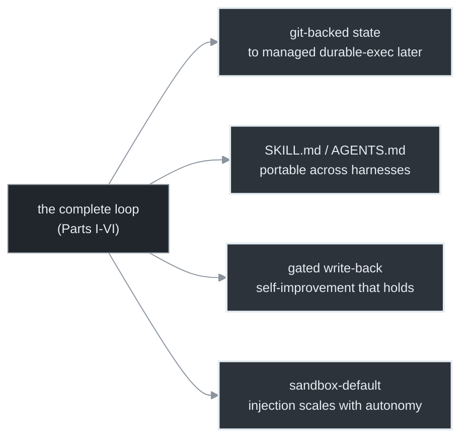
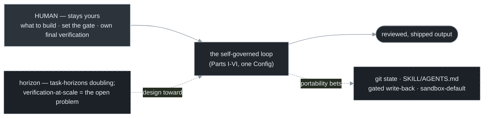

# Chapter 19 — Where This Goes Next

[← Previous](./18-anti-patterns-and-decision-framework.md) · [Index](./README.md) · [Next: Triggers as infrastructure →](./20-triggers-as-infrastructure.md)

> **Companion:** [Prior Art & Lessons from the Field](./prior-art.md) — the canonical harnesses behind every pattern in this manual, the sharper lessons it under-weights (ACI, the two-oracle gate, `pass^k`, verifier hacking), and source-by-source receipts for the directions below.

> *A forward-looking close. The patterns in this manual are stable; the surface around them is moving fast. This chapter maps where loop orchestration and agentic harnessing are heading — separating what has shipped from what is emerging from what is speculation — and what to build now so the move costs you nothing.*

<!-- milestone-delta -->
> **Part VII (Horizon) at a glance — what this chapter adds.** No new mechanics — **positioning**: four choices, each free now, that make the moving frontier a cheap adoption instead of a rewrite (git-backed state, standard `SKILL.md`/`AGENTS.md`, gated write-back, sandbox-default).


*Highlighted = what this milestone adds · dashed border = an external dependency (the model, the gate, git/forge); solid = the loop's own code + files.*

## Concept

Everything before this chapter is load-bearing now. This chapter is direction-of-travel, so it is organized by **confidence**, not by topic: what has already shipped, what is emerging with evidence, and what is genuine speculation. Treat the first as fact, the second as trends to design *toward*, and the third as scenarios to plan *around* — not bet on.

```mermaid
%%{init: {'theme':'base', 'themeVariables': {'background':'#0d1117','primaryColor':'#21262d','primaryTextColor':'#e6edf3','primaryBorderColor':'#8b949e','lineColor':'#8b949e','fontSize':'13px'}}}%%
flowchart LR
    subgraph SHIPPED["SHIPPED"]
      direction TB
      S1["task horizons<br/>still doubling"]
      S2["durable-execution<br/>platforms"]
      S3["protocols under<br/>one foundation"]
    end
    subgraph EMERGING["EMERGING"]
      direction TB
      E1["self-improving<br/>skills (gated)"]
      E2["verification<br/>at scale"]
      E3["sandbox-default<br/>+ fleet FinOps"]
    end
    subgraph SPEC["SPECULATIVE"]
      direction TB
      P1["month-long<br/>horizons (~2027?)"]
      P2["single-standard<br/>agent internet"]
      P3["teams replaced<br/>(probably not)"]
    end
    SHIPPED --> EMERGING --> SPEC
```



## How it works — the three bands

### Shipped (treat as fact)

**Task horizons are still doubling.** The length of task an agent can complete autonomously has been growing exponentially, with a measured doubling time of roughly four months and accelerating — frontier agents now reach multi-hour task horizons.[<sup>1</sup>](#sources) This is the precondition that made overnight loops viable (Chapter 17), and it has not plateaued. The practical consequence: a task that's just out of reach for a loop today is likely in reach within a couple of model generations, so the loops you can't trust yet are worth re-testing on a cadence.

**Durable execution became a platform primitive.** Checkpoint/resume — the thing you hand-rolled with commit-every-tick and git-as-database (Chapter 15) — is now available as managed infrastructure from multiple vendors.[<sup>2</sup>](#sources) The manual's git-backed approach is simpler, auditable, and vendor-neutral; the managed platforms buy resilience and operational tooling. Both are valid *now*; the trade is portability/transparency versus managed-resilience. The point for you: durability is no longer something only a big system can afford.

**The protocols consolidated under neutral governance.** The major interop pieces — the tool protocol (MCP), an agent-to-agent protocol, and the conventions-file format (`AGENTS.md`) — were placed under a single neutral foundation.[<sup>3</sup>](#sources) Portable skills and agents across harnesses moved from aspiration to a vendor-backed roadmap item. The practical read: writing your reusable units in the standard `SKILL.md` / `AGENTS.md` formats (Chapter 17) is a portability bet that is paying off.

### Emerging (design toward these)

**Self-improving loops work — but only gated.** Automating the write-back edge from Chapter 17 (loops that distill their own trajectories into reusable skills) is an active, productive research area, with validation-gated approaches reporting real accuracy gains. The load-bearing caveat: purely self-generated skills with *no* curation or eval gate "rarely help" and can regress.[<sup>4</sup>](#sources) This is Chapter 9 restated at the meta level — the gate is the variable, not the idea. Automate the flywheel, but never the gate.

**Verification at scale is the central unsolved problem.** This is the honest frontier. Current verifiers have blind spots for human-like errors and boundary conditions; generative and LLM-based verifiers improve detection but do not close the gap, and there is no trustworthy "authoritative gate the fleet can't overrule" yet.[<sup>5</sup>](#sources) Everything else can advance, but until verification at fleet scale is solved, the output-quality ceiling from Chapter 11 (the architecture is real, the outcome is not) holds. Watch this space; it is where the leverage is.

**Sandboxing-by-default and fleet FinOps are becoming table stakes.** Prompt injection scales with autonomy — malicious payloads in untrusted content are rising — and the emerging baseline for agents touching untrusted input is OS-level isolation by default with policy engines the agent cannot override (Chapter 16, becoming the industry default).[<sup>6</sup>](#sources) In parallel, cost governance for agent fleets ("FinOps for agents": per-action → per-agent → fleet-level budgets) is forming as a discipline, though governance lags spend — a minority of organizations have any AI financial guardrails in place.[<sup>7</sup>](#sources) Both are Part V disciplines becoming organizational defaults.

### Speculative (plan around, don't bet on)

**Month-long task horizons (~2027).** If the faster doubling rate holds, frontier agents reach month-long task horizons in roughly a year — but the measurement carries wide confidence intervals and is sensitive to the task suite, so this is an extrapolation, not a forecast.[<sup>1</sup>](#sources) Plan so that *if* it happens you benefit (portable state, gated skills), but don't architect as if it's certain.

**A single-standard "agent internet."** Protocol consolidation is real, but competing protocols and governance friction mean one universal standard is not guaranteed.[<sup>3</sup>](#sources) Bet on *standard formats you can port*, not on one protocol winning.

**Engineering teams replaced by fleets — probably not, near-term.** The role is shifting from implementer to orchestrator, but usage data undercuts the replacement narrative: engineers report AI assisting a majority of their work while *fully* delegating only a small fraction of tasks.[<sup>8</sup>](#sources) What stays human is consistent with this whole manual: deciding what to build, setting objectives, designing the guardrails, and owning final verification. Expect a trough of disillusionment as pilots fail to scale — driven by how agentic AI was sold and bought, not by whether the technique works.[<sup>9</sup>](#sources)

## Implement it

You don't implement the future — you position for it, today, with choices that cost nothing now and save a rewrite later. Each is a decision already covered in this manual, made with the horizon in mind:

```python
# Positioning choices — each is "free now, portable later."
PORTABILITY_BETS = {
    # Keep durable state in git (Ch 15) → adopt a managed durable-execution platform later
    # with no rewrite. Don't couple your loop to one vendor's resume API.
    "state":        "git-backed, vendor-neutral",
    # Write reusable units in the standard SKILL.md / AGENTS.md formats (Ch 17) → portable
    # across harnesses as the protocols consolidate.
    "skills":       "SKILL.md / AGENTS.md, not bespoke prompt blobs",
    # Gate every self-improvement / write-back with the verification gate (Ch 7, 9) →
    # ungated self-generated skills regress.
    "self_improve": "write-back ONLY behind the gate",
    # Sandbox by default and keep the gate authoritative (Ch 16) → injection scales with autonomy.
    "isolation":    "sandbox-default, non-overridable policy engine",
    # Track per-agent AND fleet cost (Ch 13–14) → FinOps governance is forming; instrument now.
    "cost":         "per-agent + fleet budgets, logged",
}
# Re-test the loops you can't trust yet on a cadence — the horizon that blocks them is moving.
```

Nothing here is a new technique; it's the manual's existing choices, made deliberately so the emerging shifts are adoptions, not rewrites.

## Builds on

This chapter extrapolates the manual's own disciplines: durable execution extends Chapter 15, self-improving skills extend Chapter 17's write-back edge behind Chapter 9's gate, sandbox-default and fleet FinOps extend Chapters 16 and 14, and the verification frontier is Chapter 11's unsolved output-quality problem stated at the field level. The portability bets are Part V and VI choices made with the horizon in mind.

## Pitfalls

1. **Betting on the speculative band.** Architecting as if month-long horizons or one universal protocol are certain. Position to benefit; don't depend on it.
2. **Automating the flywheel but not the gate.** Self-generated skills with no eval gate regress. Keep the gate (Chapter 9) on every write-back.
3. **Reading the coming trough as failure of the technique.** Adoption will dip as oversold pilots fall short — that's a sales-and-buying correction, not evidence the loop doesn't work. The disciplines here are what survive it.
4. **Coupling to one vendor's primitives.** Durable-execution and protocol lock-in is avoidable today with git-backed state and standard skill formats. Stay portable.

## Takeaway

Organize the future by confidence. Shipped and to be trusted: task horizons still doubling, durable execution as a platform primitive, and protocols consolidating under neutral governance. Emerging and to design toward: gated self-improving skills, verification-at-scale (the central unsolved problem), and sandbox-default plus fleet FinOps. Speculative and to plan around — not bet on: month-long horizons, a single-standard agent internet, and team replacement. You don't implement the future; you make the manual's existing choices — git-backed state, standard skill formats, gated write-back, sandbox-default, instrumented cost — so the shifts are cheap adoptions instead of rewrites.

<!-- milestone-cumulative -->
## The loop so far — Part VII — the whole system, and the boundary

What's automated and what isn't: the self-governed loop runs the work; **you** keep deciding what to build, setting the gate, and owning final verification. Keep the load-bearing pieces portable and design toward the horizon (task-horizons doubling; verification-at-scale still open).


*Solid (highlighted) = what stays human · dashed = the horizon + portability context the loop is designed toward.*

## Sources

| # | Source | Supports | Link |
|---|--------|----------|------|
| 1 | METR, *Time Horizon 1.1* (Jan 2026) | task horizons doubling ~every 4 months; multi-hour frontier; wide CIs (speculation caveat) | [metr.org](https://metr.org/blog/2026-1-29-time-horizon-1-1/) |
| 2 | Durable-execution landscape (2025–26; vendor-interested) | checkpoint/resume as a managed platform primitive, early-majority adoption | [inngest.com](https://www.inngest.com/blog/durable-execution-key-to-harnessing-ai-agents) |
| 3 | Linux Foundation — Agentic AI Foundation (Dec 2025) | MCP, A2A, AGENTS.md placed under neutral governance; portable-skills roadmap | [linuxfoundation.org](https://www.linuxfoundation.org/press/linux-foundation-announces-the-formation-of-the-agentic-ai-foundation) |
| 4 | SkillOpt (Microsoft) + SkillsBench (2026) | validation-gated self-improvement gains; ungated self-generated skills "rarely help" | [explainx.ai](https://explainx.ai/blog/microsoft-skillopt-self-improving-agent-skills-2026) |
| 5 | *Rethinking Verification for LLM Code Generation* (2025) | verifier blind spots; verification-at-scale unsolved; no trustworthy authoritative gate yet | [arxiv.org/abs/2507.06920](https://arxiv.org/pdf/2507.06920) |
| 6 | Sandboxing / injection trend reports (2026) | injection scales with autonomy; OS-level isolation + non-overridable policy as the default tier | [northflank.com](https://northflank.com/blog/how-to-sandbox-ai-agents) |
| 7 | Agent FinOps accounts (2026) | per-action→per-agent→fleet budget governance forming; guardrails lag spend | [cordum.io](https://cordum.io/blog/agent-finops-token-cost-governance) |
| 8 | Role-shift analyses (2026) | implementer→orchestrator; ~60% AI-assisted work but only 0–20% fully delegated | [oreilly.com](https://www.oreilly.com/radar/conductors-to-orchestrators-the-future-of-agentic-coding/) |
| 9 | Gartner, *Hype Cycle for Agentic AI* (2026) | coming trough = how it was sold/bought, not whether it works; ~17% deployed vs >60% intending | [gartner.com](https://www.gartner.com/en/articles/hype-cycle-for-agentic-ai) |
