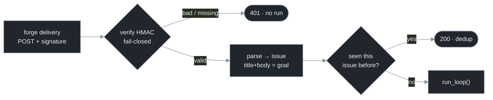

# Chapter 20 — Triggers as Infrastructure

[← Previous](./19-where-this-goes-next.md) · [Index](./README.md) · [Next: The CI deployment tier →](./21-the-ci-deployment-tier.md)

> *Chapter 12 said the loop is indifferent to what woke it. This chapter makes "what woke it" a real, public thing — a forge webhook — and confronts the two concerns that appear the moment a trigger faces the open internet: prove the delivery is real, and never run the same issue twice.*

<!-- milestone-delta -->
> **Part VIII (Deployment & the Ecosystem) at a glance — what this chapter adds.** The loop gets a **public trigger**: a webhook endpoint that turns a forge event (an issue, a comment, a push) into a run. With it come the two controls a public trigger *requires* — **authentication** (HMAC-verify every delivery, fail-closed) and **idempotency** (dedupe on the issue identity, so one issue starts at most one run). Same `run_loop`, new front door.



## Concept

A trigger is just "the thing that decides a run should start." Chapter 12 made the point that the loop doesn't care which thing that is — a human, a cron, a queue message, a webhook all drive the same `run_loop`. So far our triggers have been *trusted*: you typed the command, or a cron you configured fired it. The cheapest way to make a loop **react to your project** — an issue is filed, a PR comment asks for a fix — is a **forge webhook**: the forge POSTs a JSON event to an endpoint you run, and that endpoint starts a run.

The moment you own that endpoint, two engineering concerns appear that a trusted trigger never had, and both are non-negotiable:

- **It's public.** Anyone who finds the URL can POST to it. An unauthenticated endpoint that starts a run is an endpoint that lets a stranger spend your token and run an agent on your repo. So **every delivery must be authenticated**, and authentication must **fail closed** — anything you can't verify is rejected, not run.
- **It's at-least-once.** Forges re-deliver on any non-2xx or timeout, and a single issue emits several events you might act on (`opened`, then `labeled`). Without dedup, one issue spawns three runs racing on the same branch. So the trigger must be **idempotent**: keyed on the *issue identity*, one issue starts at most one run.

These aren't loop concerns — they're *trigger* concerns. The loop body is unchanged; what changes is the front door, and a front door on the public internet is infrastructure you secure like any other.

## How it works

**Authentication is an HMAC over the body.** GitHub signs each delivery: it computes `HMAC-SHA256(secret, body)` and sends it as `X-Hub-Signature-256`. You recompute the same HMAC with your copy of the secret and compare — in **constant time**, so a timing side-channel can't leak the digest. A match proves two things at once: the sender holds the shared secret, *and* the body wasn't tampered with in flight. GitLab is weaker — it sends the secret as a static **token** in a header, not bound to the body — so a leaked GitLab token is directly replayable, and a GitLab listener compensates by pinning its own trusted identity instead of believing the payload's claimed author.

| Concern | A trusted trigger (cron, CLI) | A public trigger (webhook) |
|---|---|---|
| Authentication | implicit (you ran it) | **explicit, fail-closed** — HMAC per delivery |
| Replays | none | re-delivery + multi-event per issue → **dedupe** |
| Untrusted input | maybe | **always** — the issue body is attacker-controllable (Ch 16) |
| Identity | you | the **issue author** — bind the run to them, not the actor who clicked |

**Idempotency is a first-writer-wins reservation.** Key it on the issue identity (`repo#number`), *not* the delivery id — otherwise a re-delivery (new delivery id, same issue) slips through, and so does the second event (`labeled` after `opened`). Reserve the key before starting; if the reservation was already taken, it's a duplicate — ack it `200` and do nothing.

And the payoff from Chapter 12 holds: the webhook, a CronJob, and the CLI all converge on **one** run-creation path. The trigger is a thin, swappable front-end; everything behind it — isolation, gates, budget — is identical no matter how the run started.

## Implement it

The whole security-critical path is pure and stdlib — `hmac` for the signature, a set for the dedupe. No framework, and unit-testable with no socket:

```python
# trigger.py — a verified, deduped webhook front-end for run_loop (Ch 12's seam, made public).
import hmac, hashlib, json

def verify(secret: str, body: bytes, signature: str | None) -> bool:
    """Constant-time HMAC check. Fail-closed: no secret, no signature, or a mismatch → False."""
    if not secret or not signature:
        return False
    expected = "sha256=" + hmac.new(secret.encode(), body, hashlib.sha256).hexdigest()
    return hmac.compare_digest(expected, signature)   # constant-time — no timing leak

_seen: set[str] = set()                               # first-writer-wins dedupe (Redis SET NX in prod)

def handle_delivery(secret: str, headers: dict, body: bytes) -> tuple[int, str]:
    if not verify(secret, body, headers.get("X-Hub-Signature-256")):
        return 401, "unauthenticated"                 # a forged/unsigned POST never starts a run
    event = json.loads(body or b"{}")
    if event.get("action") not in ("opened", "labeled"):
        return 204, "ignored"                         # only actionable issue events
    issue = event["issue"]
    key = f'{event["repository"]["full_name"]}#{issue["number"]}'
    if key in _seen:
        return 200, "duplicate"                       # re-delivery / second event → no second run
    _seen.add(key)
    goal = f'{issue["title"]}\n\n{issue.get("body") or ""}'.strip()
    run_loop(Config(goal=goal, branch=f'loop/issue-{issue["number"]}'))   # Ch 13's run_loop, unchanged
    return 202, "started"
```

A hook the prompt cannot bypass is stronger than any instruction (Chapter 16); the same logic applies here: a *verified* trigger the attacker cannot forge is stronger than trusting the payload. The verification is structural, not advisory.

> **Production reference — loopkit.** The companion reference tool **loopkit** (`~/Documents/loopkit`, the runnable form of this manual) implements this production-grade: `triggers.WebhookApp.dispatch` is the same verify → parse → authorize → dedupe → create path, behind both a GitHub (HMAC) and a GitLab (token) provider, fail-closed, with a Redis-backed dedupe for multi-replica listeners and the run bound to the **issue author**. Watch it decide six deliveries (forged → 401, signed → one run, retry + second event → dedup, unlabelled → ignored) with no socket and no tokens:
> ```bash
> loopkit demo 20      # Triggers as infrastructure — the dispatch decision tree, scripted
> ```

## Builds on

Chapter 12 established the trigger seam (the loop is indifferent to what woke it) and the principle that one run-creation path serves every trigger; this chapter makes the *public* trigger real and pays its security cost. Chapter 16's blast-radius rules are exactly why a webhook needs care: the issue body is **untrusted input** (a prompt-injection vector), so the run it starts must already be least-privilege — branch-only, no prod creds, budget-capped — because a verified delivery can still carry a hostile *payload*. Authentication stops a forged *sender*; the Chapter 16 envelope stops a hostile *body*.

## Pitfalls

1. **Trusting an unsigned POST.** An endpoint that runs on any POST is a stranger's agent on your repo. Verify every delivery; fail closed when you can't.
2. **Deduping on the delivery id.** Re-deliveries carry a new delivery id for the same issue — and `opened` then `labeled` are different events for one issue. Key dedupe on the **issue identity**, or you'll start duplicate runs.
3. **Treating GitLab's token like GitHub's signature.** GitLab's token isn't bound to the body, so it's replayable — don't trust the payload's claimed author on that path; pin a known identity.
4. **No label gate.** If every opened issue triggers a run, your backlog becomes a bill. Gate on an opt-in label so a run starts only when someone asks for it.
5. **A non-constant-time comparison.** `==` on the digest leaks timing. Use `hmac.compare_digest`.
6. **Binding the run to the actor, not the author.** On a `labeled` event the actor is whoever clicked; the run is *about the author's issue*. Bind cost and identity to the author so an attacker can only ever spend a key registered to themselves.

## Takeaway

A trigger is "what decides a run starts," and the loop never cared which trigger it was — but the moment the trigger faces the public internet, it becomes infrastructure you must secure. Authenticate every delivery with a constant-time HMAC and fail closed; dedupe on the issue identity so one issue is one run; gate on a label so runs are opt-in; and keep the run least-privilege because a *verified* delivery can still carry an *untrusted* body. The loop body doesn't change — you're hardening the front door, not the room.

## Sources

| # | Source | Supports | Link |
|---|--------|----------|------|
| 1 | GitHub Docs — *Securing your webhooks* | HMAC-SHA256 body signature, `X-Hub-Signature-256`, constant-time compare | [docs.github.com](https://docs.github.com/en/webhooks/using-webhooks/validating-webhook-deliveries) |
| 2 | GitLab Docs — *Webhook secret token* | static token in header, not bound to the body (replay caveat) | [docs.gitlab.com](https://docs.gitlab.com/ee/user/project/integrations/webhooks.html) |
| 3 | Reference implementation — **loopkit** (`triggers.py`, `loopkit demo 20`) | the verify→parse→authorize→dedupe→create path, two forges, fail-closed, issue-author binding | `~/Documents/loopkit` (local) |
| 4 | This manual, Chapters 12 & 16 | the trigger seam (one create path) and the blast-radius envelope for untrusted input | [Ch 12](./12-dynamic-workflows-and-fan-out.md) · [Ch 16](./16-permissions-and-safety.md) |
