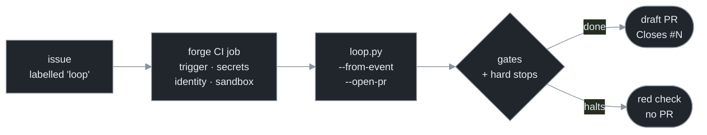

# Chapter 21 — The CI Deployment Tier

[← Previous](./20-triggers-as-infrastructure.md) · [Index](./README.md) · [Next: The capstone →](./capstone/README.md)

> *The cheapest place to run an autonomous loop on a real project is one you already operate: the forge's CI. A labelled issue starts a job, the job runs one loop, and a draft PR appears — no servers, no cluster, no secret store you built. The forge is already the trigger, the secret store, the identity, and the sandbox; the discipline is to let it be.*

<!-- milestone-delta -->
> **Part VIII (Deployment & the Ecosystem) — what this chapter adds.** No new loop mechanics — a **deployment tier**. The finished harness runs *as a CI job*: `--from-event` turns a forge issue into the goal, `--open-pr` turns DONE into a draft PR that closes the issue. The chapter's real lesson is a **principle** — *use the platform's primitives before you build your own* — and the three-tier ladder that operationalizes it.



## Concept

You have built a loop that drives an agent, verifies its work, halts on three stops, survives a crash, and stays inside its blast radius. The remaining question is operational: **where does it run, and what starts it?** There are three answers — three *deployment tiers* — and they differ only in how much the forge does for you versus how much you build yourself:

| Tier | What runs | Trigger | Secrets | Isolation | Reach for it when |
|---|---|---|---|---|---|
| **Local** | `loop.py` on your laptop | you | your shell env | your machine | iterating by hand |
| **CI** | `loop.py` in a CI job | a forge issue / pipeline | **CI-native** masked vars | the **ephemeral runner** | hands-off issue→PR, **no infra** |
| **Cloud fleet** | many workers on your own cluster | a webhook listener / cron you run | a secret store you operate | namespaces / containers you manage | many concurrent runs, evolution, multi-tenant |

The arc is **delegation shrinking as you descend**. Local delegates everything to you. The cloud fleet delegates nothing — you hand-build the trigger (Chapter 20's webhook listener), the secret store, the identity binding, and the isolation. The **CI tier sits in the sweet spot**: the forge already provides all four, so you write *zero infrastructure* and still get an autonomous, issue-driven loop. The governing principle:

> **Use the platform's primitives first.** Before you stand up a trigger, a secret store, an identity system, or a sandbox, check whether the forge already gives you one. It does — and its version is battle-tested, free, and one fewer thing you operate.

The pull to build the cloud tier first is strong, because it *feels* like real infrastructure. Resisting it until a real need (concurrency, evolution, multi-tenancy) forces the move is the difference between a loop you ship this afternoon and a cluster you babysit.

## How it works

Map the four primitives a loop needs onto what the CI runner already hands you, and the "no infrastructure" claim becomes concrete:

| Primitive | What the loop needs | What CI provides |
|---|---|---|
| **Trigger** | something starts the run | a labelled issue (`on: issues`) or a pipeline event |
| **Secrets** | the API key it spends | masked CI variables / OIDC — injected into the job, masked in logs |
| **Identity** | whose key, who's accountable | the job's scoped, short-lived token; cost attributed to the repo |
| **Sandbox** | blast-radius containment (Ch 16) | the throwaway runner — a fresh VM per job, destroyed after |

Every cell on the right is "the forge." The loop supplies only the loop. The flow: a labelled issue starts a job → the job installs the harness and runs `loop.py --from-event <event.json> --open-pr` → the loop solves the issue on a branch under the unchanged Part I–VII envelope (gates, stops, durability, least privilege) → on DONE it pushes the branch and opens a **draft** PR whose body says `Closes #N`. Draft, always: the loop proposes, a human merges (Chapter 16 — irreversible actions stay human-gated).

One honest asymmetry between the forges: **GitHub has a native issue→job trigger** (`on: issues: [opened, labeled]`); **GitLab does not**, so its CI fires on a manual run, a pipeline schedule, or a webhook→trigger token, passing the issue number as a variable. Same loop, slightly different on-ramp.

## Implement it

Two small additions turn the harness into a CI worker. First, read the forge's event into the goal — the forge writes the issue event to a file (`$GITHUB_EVENT_PATH`) and hands you its path:

```python
# loop.py — --from-event: a forge issue becomes the goal (stdlib; the goal builder is unchanged).
import json, sys

def goal_from_event(path: str) -> tuple[str, int]:
    """Read a GitHub issues event JSON → (goal, issue number). GitLab carries object_kind/iid."""
    ev = json.load(open(path))
    issue = ev["issue"]                                  # GitLab: ev["object_attributes"]
    goal = f'{issue["title"]}\n\n{issue.get("body") or ""}'.strip()
    return goal, issue["number"]

# in main(): if --from-event, set cfg.goal + remember the issue number; if --open-pr, push + draft PR
# with a body that contains f"Closes #{n}" so merging the PR closes the issue.
```

Second, the workflow file — the entire deployment, committed to the repo:

```yaml
# .github/workflows/loop.yml — a labelled issue → a draft PR, no infrastructure.
on:
  issues: { types: [opened, labeled] }
permissions: { contents: write, pull-requests: write, issues: read }   # push + draft PR
jobs:
  loop:
    if: contains(github.event.issue.labels.*.name, 'loop')             # opt-in label gate (Ch 20)
    runs-on: ubuntu-latest
    steps:
      - uses: actions/checkout@v4
        with: { fetch-depth: 0 }
      - uses: actions/setup-python@v5
        with: { python-version: '3.13' }
      - run: python loop.py --from-event "$GITHUB_EVENT_PATH" --open-pr
        env:
          ANTHROPIC_API_KEY: ${{ secrets.ANTHROPIC_API_KEY }}          # a masked repo secret
          GH_TOKEN: ${{ github.token }}                                # scoped, ephemeral — pushes the PR
```

That is the whole deployment: no server, no listener, no secret store — the four primitives are all the forge's, and the loop is a `pip install` and one command.

> **Production reference — loopkit.** The companion reference tool **loopkit** (`~/Documents/loopkit`) ships this tier as `loopkit run --from-event/--from-issue --open-pr` (plus `--adapter claude-api`, which needs no agent binary in CI) and scaffolds the workflow with `loopkit init --ci github|gitlab`. It runs the *real* loop over a canned issue event end-to-end, offline — and `--live` lets the real agent solve it:
> ```bash
> loopkit demo 21          # The CI tier: a canned issue → a draft PR, no cluster (scripted)
> loopkit demo 21 --live   # the real agent actually solves the issue
> ```
> loopkit's deeper write-up — the GitHub-vs-GitLab differences and the per-tier primitive map — is in its `docs/part-iii-ecosystem.md`.

## Builds on

Chapter 20 built a trigger *you* own and secure; this chapter is the cheaper inversion — let the forge's CI *be* the trigger, so the authentication and sandbox are the forge's problem, not yours. Chapter 16's sandbox requirement is satisfied for free by the ephemeral runner, and its "irreversible actions stay human-gated" rule is why the output is a *draft* PR. The loop body is the assembled Part I–VII harness, unchanged — `--from-event` only sources the goal, and `--open-pr` only fires the outward edge. This is the same loop you built, finally running on a real project without a server in sight.

## Pitfalls

1. **Rebuilding what the forge already gives you.** Standing up a webhook listener + secret store + sandbox when CI provides all three is effort spent to *operate more*. Earn the cloud tier with a real need, don't default to it.
2. **Per-repo identity mistaken for per-engineer.** CI secrets are repo-scoped, so a run spends the *repo's* key, attributed to the run — not to whoever filed the issue. Per-submitter keying and cost caps are a cloud-tier feature; document the difference rather than imply attribution you don't have.
3. **Merging from CI.** The loop's output is a draft PR a human reviews. Auto-merging from the job throws away the Chapter 16 human gate on the one irreversible action.
4. **Leaking a secret into logs.** CI masks declared secrets, but a key echoed by a tool can still surface. Keep the key out of the agent's reach and never print credential values.
5. **Assuming GitLab has GitHub's issue trigger.** It doesn't — wire GitLab to a manual run, a schedule, or a webhook→trigger token, and pass the issue number as a variable.
6. **Skipping the label gate.** Without it, every opened issue burns a job and a token. Gate on an opt-in label (Chapter 20).

## Takeaway

There are three deployment tiers — local, CI, cloud fleet — and they differ only in how much the forge does for you. The CI tier is the one to reach for first on a real repo: the forge is already the trigger, the secret store, the identity, and the sandbox, so an issue-driven loop that opens a draft PR is a workflow file and one command, with **no infrastructure to operate**. Use the platform's primitives before you build your own; descend to the cloud fleet only when concurrency, evolution, or multi-tenancy actually forces it. The loop you built across this manual doesn't change — you're just choosing where it runs.

<!-- milestone-cumulative -->
## The loop so far — deployed

The self-governed loop is complete and now has a home. It primes a fresh context, calls the agent, verifies the result against gates it can't game, reviews each commit, halts on the three hard stops, commits durably, runs least-privilege inside a sandbox — and it runs **where the work is**: on your laptop by hand, in CI off a labelled issue with zero infrastructure, or across your own fleet when scale demands it. The [capstone](./capstone/README.md) is the harness assembled and runnable; **loopkit** is its production-grade form, deployed across all three tiers.

## Sources

| # | Source | Supports | Link |
|---|--------|----------|------|
| 1 | GitHub Docs — *Events that trigger workflows* (`issues`) | native issue→job trigger; `GITHUB_EVENT_PATH`; the job token | [docs.github.com](https://docs.github.com/en/actions/using-workflows/events-that-trigger-workflows#issues) |
| 2 | GitLab Docs — *Pipeline trigger tokens / scheduled pipelines* | GitLab's lack of a native issue trigger; the manual/scheduled/trigger-token on-ramp | [docs.gitlab.com](https://docs.gitlab.com/ee/ci/triggers/) |
| 3 | Reference implementation — **loopkit** (`run --from-event`, `init --ci`, `demo 21`) | the CI tier end-to-end: issue→goal→draft PR; the three-tier model; per-repo vs per-submitter identity | `~/Documents/loopkit` (local) |
| 4 | This manual, Chapters 16 & 20 | the sandbox + human-gate rules; the public trigger this tier delegates to the forge | [Ch 16](./16-permissions-and-safety.md) · [Ch 20](./20-triggers-as-infrastructure.md) |
